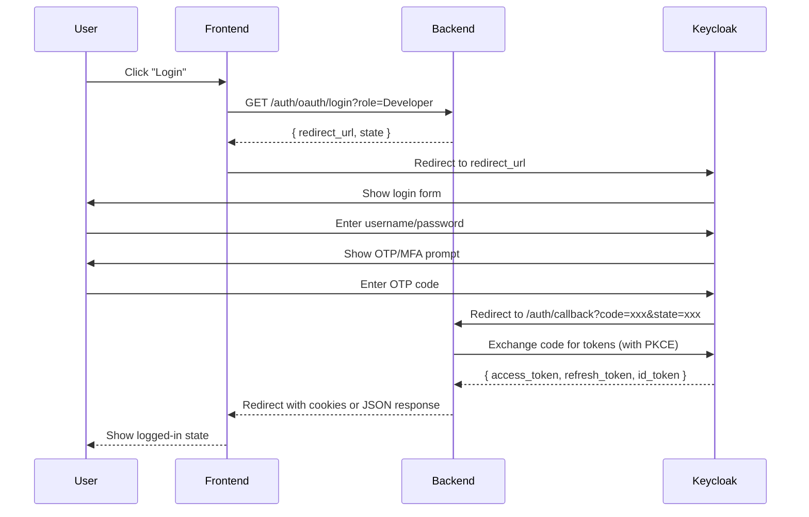

# Keycloak MFA/OTP Authentication Setup Guide

This guide explains how to configure the IAF backend to support Keycloak Multi-Factor Authentication (MFA) using Google Authenticator or similar TOTP apps.

## Overview

When MFA is enabled in Keycloak, the **direct username/password login** (Resource Owner Password Credentials grant) **does not work** because there's no UI step to show the QR code or enter the OTP.

The solution is to use the **Authorization Code Flow with PKCE**, which:
1. Redirects users to Keycloak for authentication
2. Keycloak handles the login UI (username/password + MFA/OTP)
3. Keycloak redirects back to your app with an authorization code
4. Your backend exchanges the code for tokens

## Environment Configuration

Add these settings to your `.env` file:

```env
# ===== Keycloak OAuth Settings (MFA Support) =====

# Redirect URI where Keycloak sends the authorization code after login
# Must match EXACTLY what's configured in Keycloak client settings
KEYCLOAK_REDIRECT_URI=http://localhost:8000/auth/callback

# Where to redirect after Keycloak logout
KEYCLOAK_POST_LOGOUT_REDIRECT_URI=http://localhost:8000

# Where to redirect the browser after successful OAuth callback (your frontend)
FRONTEND_REDIRECT_URI=http://localhost:3000

# OAuth state token expiry (seconds) - default 10 minutes
OAUTH_STATE_EXPIRY_SECONDS=600

# IMPORTANT: Disable direct login to enforce MFA
# Set to 'false' when MFA is enabled in Keycloak
KEYCLOAK_ALLOW_DIRECT_LOGIN=false

# Session cookie settings
SESSION_COOKIE_NAME=iaf_session
SESSION_COOKIE_SECURE=false  # Set to 'true' in production (HTTPS required)
SESSION_COOKIE_SAMESITE=lax  # Use 'none' for cross-site flows (requires COOKIE_SECURE=true)
```

## Keycloak Client Configuration

In your Keycloak Admin Console, configure your client:

1. **Client Settings:**
   - Access Type: `confidential` (recommended) or `public`
   - Standard Flow Enabled: `ON` ✅
   - Direct Access Grants Enabled: `OFF` ❌ (disable for MFA)
   - Valid Redirect URIs: `http://localhost:8000/auth/callback` (match your KEYCLOAK_REDIRECT_URI)
   - Valid Post Logout Redirect URIs: `http://localhost:8000/*`
   - Web Origins: `http://localhost:8000` and `http://localhost:3000` (your frontend)

2. **Enable MFA/OTP:**
   - Go to **Authentication** → **Required Actions**
   - Enable "Configure OTP" as a required action for new users
   - Or go to **Authentication** → **Flows** → Configure browser flow with OTP

## API Endpoints

### New OAuth Endpoints (MFA Compatible)

| Endpoint | Method | Description |
|----------|--------|-------------|
| `/auth/oauth/login` | GET | Initiates OAuth login, returns Keycloak redirect URL |
| `/auth/callback` | GET | Handles Keycloak callback with authorization code |
| `/auth/callback` | POST | Alternative callback for SPA flows |
| `/auth/oauth/logout` | GET | Returns Keycloak logout URL |
| `/auth/oauth/logout` | POST | Clears cookies and returns logout URL |
| `/auth/oauth/status` | GET | Returns OAuth configuration status |

### Legacy Endpoint (Disabled when MFA enabled)

| Endpoint | Method | Description |
|----------|--------|-------------|
| `/auth/login` | POST | Direct username/password login (does NOT support MFA) |

## Login Flow

### For Web Applications (Browser-based)



### API Usage Examples

#### 1. Start OAuth Login

```bash
# Request
curl -X GET "http://localhost:8000/auth/oauth/login?role=Developer"

# Response
{
  "redirect_url": "https://keycloak.example.com/realms/myrealm/protocol/openid-connect/auth?client_id=...",
  "state": "abc123...",
  "message": "Redirect to Keycloak for authentication"
}
```

The frontend should redirect the user's browser to `redirect_url`.

#### 2. Handle Callback (After Keycloak Authentication)

Keycloak will redirect to your callback URL with `code` and `state` parameters.

**Browser Flow (GET):**
```bash
# Keycloak redirects to:
GET /auth/callback?code=authorization_code&state=abc123...

# Backend validates, exchanges code for tokens, and either:
# - Redirects to frontend with cookies set
# - Returns JSON with tokens
```

**SPA Flow (POST):**
```bash
# If your SPA intercepts the redirect
curl -X POST "http://localhost:8000/auth/callback" \
  -H "Content-Type: application/json" \
  -d '{
    "code": "authorization_code_from_url",
    "state": "state_from_url"
  }'

# Response
{
  "approval": true,
  "token": "eyJ...",
  "refresh_token": "...",
  "id_token": "...",
  "role": "Developer",
  "username": "john.doe",
  "email": "john@example.com",
  "message": "Login successful",
  "expires_in": 300
}
```

#### 3. Logout

```bash
# Get logout URL
curl -X GET "http://localhost:8000/auth/oauth/logout"

# Response
{
  "success": true,
  "logout_url": "https://keycloak.example.com/realms/myrealm/protocol/openid-connect/logout?...",
  "message": "Redirect to Keycloak to complete logout"
}

# Redirect user to logout_url to complete Keycloak logout
```

## Frontend Integration

### React/JavaScript Example

```javascript
// Login button handler
async function handleLogin() {
  // 1. Get OAuth redirect URL
  const response = await fetch('/auth/oauth/login?role=Developer');
  const { redirect_url, state } = await response.json();
  
  // 2. Store state for validation (optional, backend handles it)
  sessionStorage.setItem('oauth_state', state);
  
  // 3. Redirect to Keycloak
  window.location.href = redirect_url;
}

// Callback page handler (e.g., /auth/callback route in your frontend)
async function handleCallback() {
  const urlParams = new URLSearchParams(window.location.search);
  const code = urlParams.get('code');
  const state = urlParams.get('state');
  
  // If backend already handled it via redirect, tokens are in cookies
  // Otherwise, call the POST endpoint:
  const response = await fetch('/auth/callback', {
    method: 'POST',
    headers: { 'Content-Type': 'application/json' },
    body: JSON.stringify({ code, state })
  });
  
  const result = await response.json();
  if (result.approval) {
    // Store tokens and redirect to app
    localStorage.setItem('user', JSON.stringify({
      email: result.email,
      role: result.role,
      username: result.username
    }));
    window.location.href = '/dashboard';
  }
}

// Logout handler
async function handleLogout() {
  const response = await fetch('/auth/oauth/logout', { method: 'POST' });
  const { logout_url } = await response.json();
  
  // Clear local storage
  localStorage.removeItem('user');
  
  // Redirect to Keycloak to complete logout
  window.location.href = logout_url;
}
```

## Security Features

### PKCE (Proof Key for Code Exchange)

The implementation uses PKCE to protect against authorization code interception attacks:
- `code_verifier`: Random 128-character string stored server-side
- `code_challenge`: SHA-256 hash of verifier sent to Keycloak
- Keycloak verifies the challenge matches the verifier during token exchange

### State Parameter (CSRF Protection)

- Random state token generated for each login attempt
- Validated in callback to prevent cross-site request forgery
- Single-use and expires after 10 minutes

### Nonce (Replay Protection)

- Random nonce included in authorization request
- Validated in ID token to prevent replay attacks

## Troubleshooting

### "Invalid or expired state parameter"

- User took too long to complete login (>10 minutes)
- User used browser back button after completing login
- **Solution:** Redirect user to start login flow again

### "Direct login is disabled"

- MFA is enabled and `KEYCLOAK_ALLOW_DIRECT_LOGIN=false`
- **Solution:** Use OAuth flow endpoints (`/auth/oauth/login`)

### "Invalid redirect URI"

- `KEYCLOAK_REDIRECT_URI` doesn't match Keycloak client configuration
- **Solution:** Ensure exact match in Keycloak Admin Console → Client → Valid Redirect URIs

### "Token exchange failed"

- Invalid client secret
- PKCE code_verifier mismatch
- **Solution:** Check `KEYCLOAK_CLIENT_SECRET` and ensure PKCE is enabled in Keycloak

## Migration from Direct Login

1. Set `KEYCLOAK_ALLOW_DIRECT_LOGIN=false` in your `.env`
2. Update frontend to use OAuth flow endpoints
3. Configure Keycloak client settings (disable Direct Access Grants)
4. Enable MFA in Keycloak Authentication settings
5. Test the complete flow
