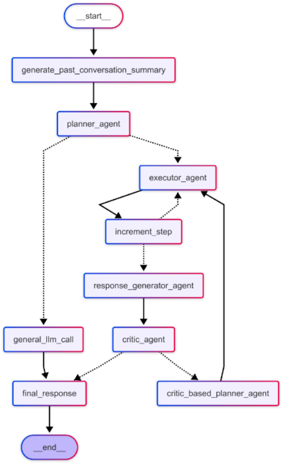
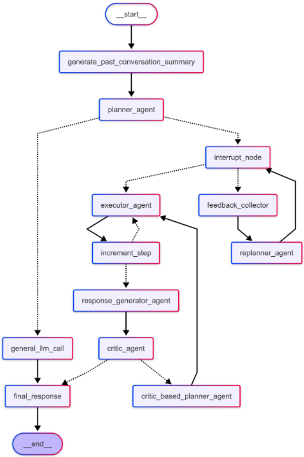

### Multi Agent Design

|  |  |
|:--:|:--:|
| **Multi Agent Without Feedback** | **Multi Agent With Feedback** |

The **Multi Agent** operates on the **Planner-Executor-Critic** paradigm, which involves three key components:

1. **Planner Agent**: Generates a detailed step-by-step plan based on the user query.
2. **Executor Agent**: Executes each step of the plan sequentially.
3. **Critic**: Evaluates the outputs of each step by scoring the results.

The framework supports two types of Multi Agents, differentiated by their feedback mechanism: **With Feedback** (Human-in-the-Loop) and **Without Feedback** (Fully Automated). Users have the flexibility to enable or disable the Human-in-the-Loop feature based on their requirements.

**How It Works**:

#### 1. Multi Agent Without Feedback

1. The user provides a query, and the `Planner Agent` generates a clear, step-by-step plan.
2. The plan is passed to the `Executor Agent`, which executes each step sequentially.
3. The `Response Generator Agent` processes the results and sends them to the `Critic` for evaluation.
4. The `Critic` scores the response:
   - If the score meets the threshold, the final response is returned to the user.
   - If the score is below the threshold, the response is sent back to the `Critic-Based Planner Agent` for refinement. The process repeats until an accurate response is generated.

This entire process happens internally and is not visible to the user. The user only sees the final response, ensuring a seamless experience.

#### 2. Multi Agent With Feedback

1. After the `Planner Agent` generates a step-by-step plan, the user can review the plan.
2. If the `Human-in-the-Loop` option is enabled:
   - `Approval`: If the user is satisfied with the plan, they can approve it by clicking a thumbs-up or like button. The approved plan is then passed to the `Executor Agent`, which executes each step sequentially. The results are evaluated by the `Critic`, and the process continues as in the `Without Feedback` mode.
   - `Rejection`: If the user is not satisfied with the plan, they can reject it by clicking a thumbs-down button and providing feedback. This feedback is sent to the `Re-Planner Agent`, which refines the plan based on the user's input. The process repeats until the user approves the plan.
3. Once the plan is finalized and approved, the system proceeds with execution and evaluation, ultimately delivering the final response to the user.

This mode allows users to actively participate in the planning process, ensuring the generated plan aligns with their expectations. By incorporating user feedback at critical stages, the `With Feedback` mode enhances accuracy, adaptability, and user satisfaction.