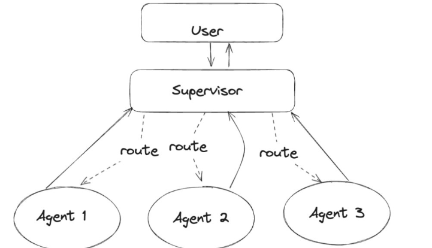

### Meta Agent Design

The `Meta Agent`, also known as the `Supervisor Agent`, orchestrates a combination of worker agents — which can be ReAct agents, Multi-Agents, or hybrids of both. It manages and supervises these worker agents by deciding which agent(s) to invoke based on the user's query and coordinates their responses to deliver the final answer.
 
 
**How It Works**:

1. **User Query Input**:

    The user query is received by the Meta Agent, which acts as the central supervisor.
 
2. **Worker Agent Selection**:

    The Meta Agent analyzes the query and decides which type of worker agent (ReAct, Multi-Agent, or a combination) is best suited to handle the task based on the query’s complexity, required capabilities, and context.
 
3. **Delegation to Worker Agent(s)**:

    The selected worker agent(s) are called upon to process the query. Each worker agent internally uses their bound tools — small Python functions implementing specific logic or actions — to perform their tasks.
 
4. **Worker Agent Processing**:
 
    - ReAct Agents proceed through their iterative reasoning and acting cycle (reasoning about tools, acting, observing results, and refining).
 
    - Multi-Agents may work collaboratively or independently, coordinating their tools and knowledge to resolve the query.
 
5. **Response Aggregation**:

    The Meta Agent collects and evaluates responses from the worker agent(s).
 
6. **Decision Making & Final Answer**:

    Based on aggregated responses and overall context, the Meta Agent decides:
 
    - To invoke additional worker agents if needed, or
 
    - To conclude and return the final consolidated answer to the user.
 
The Meta Agent (Supervisor) acts as a high-level controller that dynamically delegates tasks to the most appropriate internal worker agent(s), whether ReAct, Multi-Agent, or a hybrid. It handles query routing, response coordination, and final decision-making, ensuring a flexible and efficient multi-layered reasoning and action system that leverages specialized tools bound to each agent.