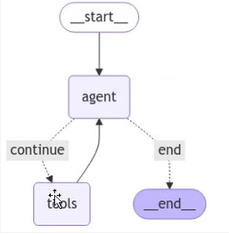

### React Agent Design

The `ReAct (Reasoning and Acting)` agent is designed to combine reasoning traces with action execution. It follows a step-by-step process to determine the appropriate tools to use, execute actions, observe the results, and iteratively refine its decisions until it arrives at a final answer.

**How It Works**:

1. **User Query Input**:  
   The process begins with the user query being passed to the React Agent.

2. **Reasoning Phase**:  
   The agent analyzes the query and reasons about which tools are required to address the task. This reasoning is based on the context and the nature of the query.

3. **Action Phase**:  
   The agent takes action by invoking the appropriate tool(s). For example, it may call an external API, perform a computation, or retrieve data.

4. **Feedback Loop**:  
   The response from the tool is fed back into the React Agent. The agent evaluates the tool's output and determines whether additional tools need to be called or if the process can be concluded.

5. **Decision Making**:  
   Based on the user query and the results obtained from the tools, the agent decides:
      - Whether to call another tool for further processing.
      - Whether to stop and return the final answer to the user.

This iterative reasoning and acting process ensures that the React Agent can handle complex queries efficiently by dynamically adapting its actions based on the context and intermediate results. It is particularly useful for scenarios requiring logical decision-making and multi-step workflows.