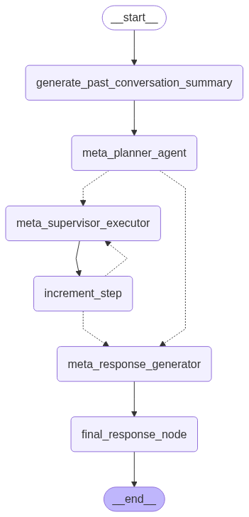

### Planner Meta Agent Design

The **Planner Meta Agent** extends the concept of meta-level orchestration by combining advanced planning capabilities with dynamic agent management. Acting as a high-level controller, the Planner Meta Agent coordinates multiple specialized worker agents—such as Planner-Executor agents, ReAct agents, or Multi-Agents—to solve complex user queries efficiently and flexibly.

**Key Responsibilities:**

1. **User Query Reception**: The Planner Meta Agent receives the user's query and serves as the entry point for the orchestration process.

2. **Strategic Planning**: It formulates a high-level plan or workflow, breaking down the query into manageable sub-tasks. This plan determines which worker agents or agent types are best suited for each sub-task.

3. **Agent Selection and Delegation**: Based on the plan, the Planner Meta Agent selects appropriate worker agents (e.g., Planner-Executor, ReAct, or Multi-Agent) and delegates sub-tasks to them. Each agent is chosen for its specialized capabilities relevant to the sub-task.

4. **Supervision and Coordination**: The Planner Meta Agent supervises the execution of sub-tasks, monitors progress, and coordinates communication between agents. It ensures that outputs from one agent can be used as inputs for others when necessary.

5. **Aggregation and Evaluation**: After all sub-tasks are completed, the Planner Meta Agent aggregates the results, evaluates their quality, and determines if further refinement or additional agent invocation is needed.

6. **Final Decision and Response**: Once the aggregated results meet the desired criteria, the Planner Meta Agent compiles the final answer and returns it to the user.

**Advantages:**

- **Hierarchical Control**: Enables multi-layered reasoning and action by combining planning, delegation, and supervision.
- **Flexibility**: Dynamically selects and coordinates specialized agents based on task requirements.
- **Scalability**: Can handle complex, multi-step queries by decomposing them and leveraging multiple agents in parallel or sequence.

This design ensures robust, adaptive, and transparent orchestration of agent-based workflows, making it suitable for advanced AI systems that require both strategic planning and dynamic execution across diverse agent types.
