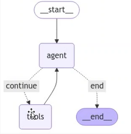

### React Agent Design

The `ReAct (Reasoning and Acting)` agent is an intelligent system that combines reasoning traces with action execution. It follows a systematic, iterative process to analyze queries, select appropriate tools, execute actions, and refine decisions until reaching a final answer.

**How It Works**:

**1. User Query Input**:

   The process begins when a user query is passed to the React Agent for processing.

**2. Reasoning Phase**:  

   The agent performs context-aware analysis of the query to determine:

   - The nature and complexity of the task
   - Which tools or resources are required
   - The optimal sequence of actions needed

**3. Action Phase**: 

   The agent executes the selected action by invoking appropriate tools, which may include:

   - External API calls
   - Data retrieval operations
   - Computational tasks
   - Database queries

**4. Observation and Evaluation**: 

   After each action, the agent:

   - Receives and analyzes the tool's output
   - Evaluates the quality and completeness of the response
   - Determines if the results satisfy the query requirements

**5. Decision Making**:  

   Based on the evaluation, the agent decides whether to:
   
   - Execute additional tools for further processing
   - Refine the current approach with different parameters
   - Conclude the process and return the final answer

**6. Iterative Refinement**:

   If additional processing is needed, the agent returns to the reasoning phase with updated context, creating a feedback loop that continues until the query is fully resolved.

**Key Benefits**:

- **Dynamic Adaptation**: Adjusts strategy based on intermediate results
- **Multi-step Processing**: Handles complex queries requiring sequential operations
- **Efficient Resource Usage**: Only invokes necessary tools
- **Logical Decision-Making**: Makes informed choices at each step

This iterative reasoning and acting process ensures that the React Agent can handle complex queries efficiently by dynamically adapting its actions based on the context and intermediate results. It is particularly useful for scenarios requiring logical decision-making and multi-step workflows.