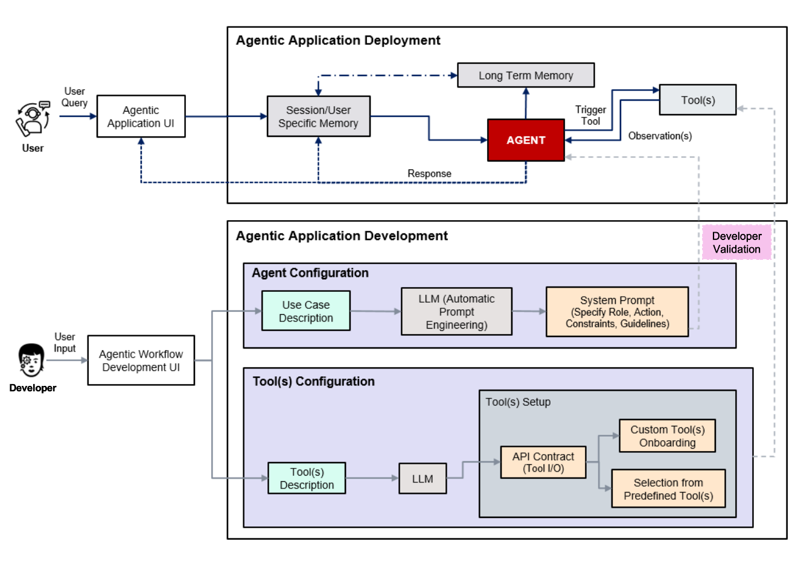
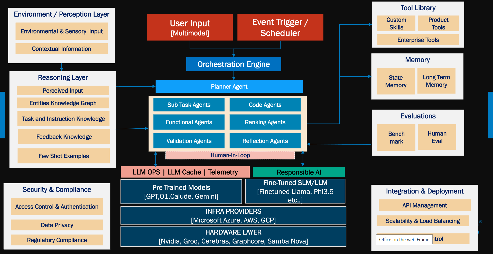

<!-- meta agent -->

### Agents

- **Reusable Templates**: Developers can utilize predefined, reusable templates to streamline the creation of agents. These templates allow for the rapid definition of agents with specific roles or persona attributes, ensuring consistency and reducing development time.
- **Customizable Roles**: Agents can be tailored to meet the unique requirements of an application by defining their behaviors, objectives, and interaction styles. This flexibility enables developers to create agents that align with specific use cases or business goals.

We mainly have three types of templates: **React**, **Multi**, and **Meta**.

**React Template**: 

The ReAct(Reasoning and Acting) agent combines reasoning traces with action execution. It uses a step by step thought process to determine what tool to use, executes it, observe the result, and continues until it can return a final answer.

` Use Case` : 

When the task requires step-by-step reasoning and immediate action execution.

` Examples` :

1. Answering user queries by reasoning through available data and tools.
2. Performing calculations or data lookups with a clear sequence of steps.
3. Interactive troubleshooting or debugging tasks where the agent needs to reason and act iteratively.

**Multi Template**: 

The Multi Agent operates on the Planner-Executor-Critic paradigm. It begins with a Planner Agent that generates a step-by-step plan based on the user query. The Executor Agent then executes each step of the plan. The Critic evaluates the outputs by scoring the results of each step.

` Use Case` : 

When the task involves a complex workflow that requires planning, execution, and evaluation.

` Examples` :

1. Multi-step project management tasks where a detailed plan is needed.
2. Executing a sequence of dependent tasks, such as data processing pipelines.
3. Scenarios where outputs need to be evaluated and scored for quality or correctness.

**Meta Template**: 

Meta templates are used for agents that require higher-level reasoning or orchestration capabilities. These agents can manage other agents, coordinate tasks, or oversee complex processes, making them suitable for supervisory or managerial roles within the system.

` Use Case` : 

When the task requires higher-level orchestration, coordination of multiple agents, or managing complex processes.

` Examples` :

1. Supervising multiple agents working on different parts of a large project.
2. Overseeing workflows that involve dynamic task allocation and coordination.
3. Managing and optimizing resource allocation across multiple agents or tools.

---

### Tools

- **Tool Management**: A centralized interface is provided to manage all supported tools. This interface simplifies the process of enabling, disabling, or configuring tools, ensuring that developers have full control over the orchestration environment.
- **Custom Tool Integration**: The framework supports seamless integration of custom tools, allowing developers to onboard new tools without disrupting existing workflows. This ensures scalability and adaptability as new tools or technologies emerge.
---

### Memory

- **Session Memory**: Designed to retain context-specific data during the current session, session memory ensures that interactions remain coherent and contextually relevant. This is particularly useful for multi-turn conversations or complex workflows.
- **Persistent Memory**: Persistent memory goes beyond the session, storing user behaviors, preferences, and historical data over time. This enables the system to provide personalized experiences, maintain long-term context, and adapt to user needs dynamically.

---

### Architecture Design Diagram

The diagram titled **"Orchestration Design"** illustrates the architecture of the orchestration system. It highlights the interaction between agents, tools, and memory components. Key elements include:

1. **Agents**: Represented as modular entities that interact with tools and memory to perform tasks or provide responses.
2. **Tools**: Shown as a collection of integrated utilities that agents can leverage to enhance their functionality.
3. **Memory**: Depicted as a dual-layered system comprising session memory for short-term context and persistent memory for long-term personalization.
4. **Workflow**: The diagram emphasizes the seamless flow of data and interactions between these components, ensuring a cohesive and efficient orchestration process.

This visual representation underscores the modularity and scalability of the system, making it easier for developers to understand and extend the orchestration framework.

---
### Agent-as-a-Service: Reference Architecture

