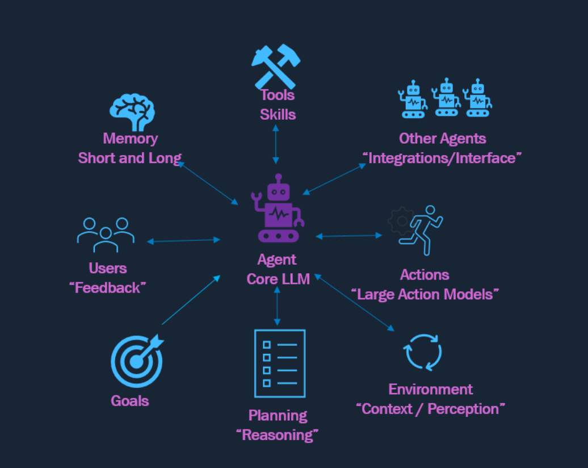
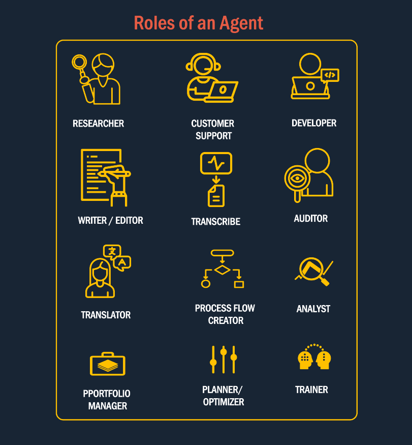

### What is an AI Agent?

An AI agent is an `autonomous` entity that can `perceive` its environment and take `actions` to achieve specific `goals`. 

**Tools/Skills**  
External functionalities that an AI agent can leverage to perform specific tasks. These extend the agent's capabilities beyond language understanding, enabling it to execute actions and interact with external systems effectively.

**Other Agents (Integrations/Interfaces)**  
Interfaces or connections with other AI agents or systems. These enable collaboration, task delegation, and seamless integration within a multi-agent ecosystem or with external applications.

**Actions (Large Action Models)**  
Predefined or dynamically learned complex operations that the agent can execute to achieve specific objectives or respond to user queries.

**Environment (Context/Prediction)**  
The external state or data that the agent perceives and reacts to. This allows the agent to adapt its behavior dynamically based on real-time context or changing scenarios.

**Planning (Reasoning)**  
The cognitive process of determining the next steps based on goals, environmental inputs, and memory. Planning drives the logical sequencing of actions and tool usage to accomplish tasks efficiently and effectively.

**Goals**  
The objectives or desired outcomes defined for or by the agent. These guide the agent's decision-making and planning processes, ensuring its behavior aligns with its mission or user expectations.

**User (Feedback)**  
Human users who interact with the agent and provide feedback, corrections, or instructions. This feedback helps refine the agent's responses and ensures alignment with user needs and expectations.

**Memory (Short and Long)**  
The storage of past interactions or knowledge, categorized as:  
- **Short Term Memory**: Temporary context retained during the current conversation or session.  
- **Long Term Memory**: Persistent data stored across sessions, enabling the agent to maintain continuity and personalization over time.

**Agent (Core LLM)**  
The central decision-making entity, typically powered by a large language model (LLM). It performs natural language understanding, reasoning, and orchestrates all other components to complete tasks and provide meaningful responses.

---

### Key Components of an Agent ​
<!--  -->

**LLM**
The brain of the agent that interprets instructions from humans or other agents, plans actions, or evaluates alternatives.

**Memory**
This where instructions, feedback, external stimulus and states are stored.

**Integrations/ Interface**
Agents need to communicate with other agents, humans or LLms to pass on messages, prompts, feedback and instructions.

**Adaptive**
Agents adapt and learn dynamically from the real time environment and adjust their actions.

**Skills and Tools**
This is the device like web-browser, fill forms, use other applications(API's) tools like OCR, image generators, social media plugins etc. to take real life actions.

**Reasoning Capabilities**
Different additional frameworks like Chain/Graph of thoughts, RAG Setups, vector DBs are needed to augment performance.

--- 

### Roles of an Agent
AI agents can adopt a wide range of roles based on the task, domain, and context in which they are deployed. These roles showcase the adaptability and functional versatility of intelligent agents, making them valuable across both business and technical environments.

---

### React Agent

The **ReAct(Reasoning and Acting)** agent combines reasoning traces with action execution. It uses a step by step thought process to determine what tool to use, executes it, observe the result, and continues until it can return a final answer.

### Multi Agent

The **Multi Agent** operates on the `Planner-Executor-Critic` paradigm. It begins with a `Planner Agent` that generates a step-by-step plan based on the user query. The `Executor Agent` then executes each step of the plan. The `Critic` evaluates the outputs by scoring the results of each step.

### Planner Agent 
 
The Planner Agent is responsible for creating a detailed, step-by-step plan to achieve a given objective or respond to a user query. It interprets the user's instructions, breaks them down into actionable steps, and presents the plan for review or execution. This ensures clarity, structure, and alignment with the desired outcome.

### Executor Agent

The Executor Agent is responsible for carrying out the steps outlined by the Planner Agent. It executes each step in the plan. The Executor Agent ensures that actions are performed accurately and efficiently, adapting to any changes or feedback during execution to achieve the desired outcome.

### Critic Agent
The Critic Agent evaluates the outputs generated during the execution process. It assigns a score to each result based on predefined criteria or thresholds. If the score meets or exceeds the threshold, the Critic Agent finalizes the response and presents it to the user. If the score falls below the threshold, the Critic Agent triggers internal adjustments or refinements to improve the output, ensuring the final response is accurate and aligned with user expectations.

### Meta Agent

Serves as the central decision making entity. Individual agents are coordinated by a central **supervisor** agent. The supervisor controls all communication flow and task delegation, making decisions about which agent to invoke based on the current context and task requirements.

