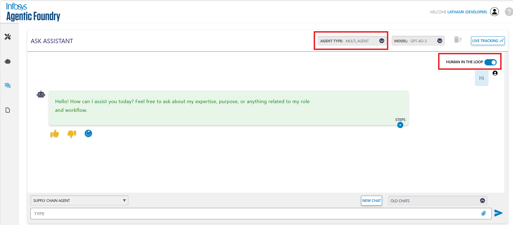
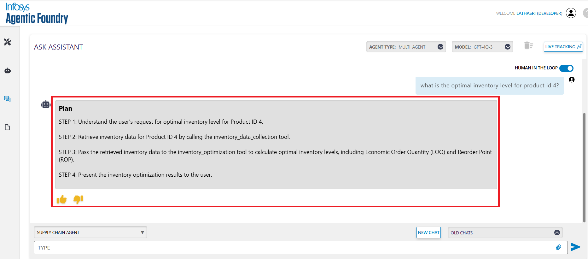
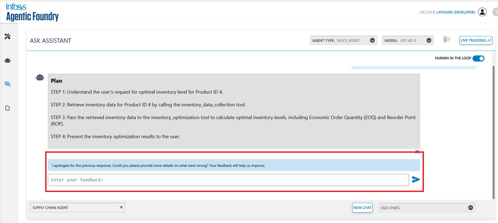

# Human Involvement in Agentic Frameworks

Human-in-the-loop (HITL) is a system design approach where human input, oversight, or decision-making is integrated into an automated or AI-driven process to improve accuracy, safety, or control.

In the Agentic Foundry Framework, HITL is included as a core element of the **Multi Agent**, ensuring that humans can guide or intervene in agent behavior when necessary.

---

## Overview: Human Intervention in AI Systems

Human intervention refers to the active or passive role a human plays during the lifecycle of an AI or agent system. In our framework, this intervention is integrated at multiple stages:

- **Design phase**: Humans select and configure tools that the agent will use.
- **Execution phase**: Humans monitor outputs and provide feedback as needed.
- **Learning phase**: Humans review performance and provide examples to refine the agent.

The goal is to combine the speed and efficiency of automation with the contextual understanding, judgment, and oversight that only humans can provide.

---

## Human-in-the-Loop (HITL)

In this mode, humans are an essential part of the decision-making process. The agent does not proceed without human input at critical steps. This ensures high accuracy and safety, especially in sensitive or high-stakes domains.

 **Application in the Framework**

- During inference, the agent may generate a draft response that requires human review before it is finalized and returned.
- During tool onboarding, the user manually selects or curates data, tools, or prompts.

**Typical Use Cases**

- Domains requiring high precision, such as healthcare or legal advice.
- Tasks where incorrect or biased outputs could have serious consequences.
- Content moderation or generation where user approval is required.

**Workflow**

1. The user submits a query or task to the agent.
2. The agent generates a preliminary output, such as a step-by-step plan based on the user query.

3. The human reviews the plan and has the option to approve or reject it:
    - **Approve**: If the user approves the plan, the agent finalizes the output and returns the answer.
    - **Reject**: If the user rejects the plan, they provide feedback. The agent uses a replanner mechanism to regenerate a revised plan based on the feedback.
    
4. Once the revised plan is approved, the final answer is returned to the user.

