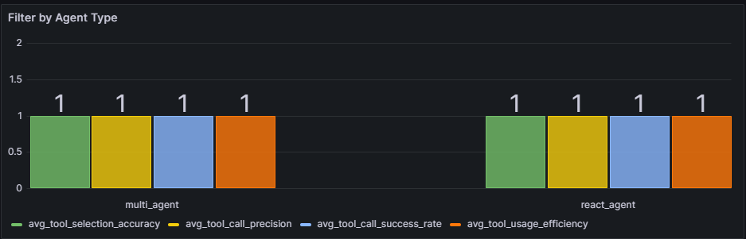

# Evaluation Metrics

Evaluation metrics are essential for assessing the performance and efficiency of AI agents. This document outlines the evaluation metrics used to measure the effectiveness of AI agents, focusing on the **LLM as Judge** approach.

## LLM as Judge Approach

The **LLM as Judge** approach involves using a large language model (LLM) to evaluate the performance of AI agents. The LLM acts as an impartial evaluator, analyzing the agent's actions, reasoning, and responses based on predefined metrics. This approach ensures a consistent and objective evaluation process.

---

## Evaluation metrics workflow

- while inferencing, we are storing the data required for the evaluation in a postgres evaluation_data table with initial status as unprocessed.
- we have an endpoint - /evaluate, when get hit, it fetches one by one unprocessed records from the evaluation_data table.
for each record,
    - agent evaluation metrics are calculated. 
    - if there are any tool calls, tool evaluation metrics are calculated.
    - scores will be stored in agent_evaluation_metrics and tool_evaluation_metrics tables referencing the evaluation_data table respectively.
    - if scores are calculated successfully, the status will be updated as success, otherwise error.
- this process is repeated until all the unprocessed records are processed.
- now, we connect grafana with our tables to display these scores on dashboard.

---

## Tool Utilization Efficiency

This metric evaluates how effectively the AI agent selects and uses external tools.

| **Metric**                 | **Description**                                                                 |
|----------------------------|---------------------------------------------------------------------------------|
| **Tool Selection Accuracy** | The rate at which the AI chooses the most appropriate tool for a given task.    |
| **Tool Usage Efficiency**   | A measure of how optimally the AI uses selected tools, considering factors like unnecessary calls and resource usage. |
| **Tool Call Precision**     | The accuracy and appropriateness of parameters used in tool calls.              |
| **Tool Call Success Rate**  | Success rate of the overall tool calls.                                         |

**Overall Score**: The overall score for Tool Utilization Efficiency is based on the scores of the evaluation metrics above.

---

## Agents Efficiency Score

This metric measures the efficiency of the agentic workflow.

| **Metric**                     | **Description**                                                                 |
|--------------------------------|---------------------------------------------------------------------------------|
| **Task Decomposition Efficiency** | The AI's ability to break down complex tasks into manageable sub-tasks.         |
| **Reasoning Relevancy**         | Ensures the agent’s reasoning aligns with the user query. Is the reasoning behind each tool call clearly tied to what the user is asking for? |
| **Reasoning Coherence**         | Checks the logical flow in the agent’s reasoning. Does the reasoning follow a logical, step-by-step process? Each step should add value and make sense in the context of the task. |
| **Agent Robustness**            | Measures the ability of the AI agent to handle unexpected inputs, errors, and adversarial scenarios while maintaining performance and reliability. |
| **Agent Consistency**           | Measures the AI agent's ability to produce stable, repeatable, and logically coherent responses across multiple interactions with similar inputs. |
| **Answer Relevance**            | Checks if the answer is relevant to the input.                                  |
| **Groundedness**                | Evaluates how well the agent’s responses are anchored in factual, verifiable, and contextually relevant sources, minimizing hallucination and misinformation. |
| **Response Fluency**            | Assesses the readability, grammatical correctness, and naturalness of the agent’s responses. |
| **Response Coherence**          | Measures whether the agent's response is logically structured and maintains clarity throughout the conversation. |

**Overall Score**: The overall score for Agents Efficiency Score is based on the scores of the evaluation metrics above.

---

## Filters in Evaluation Metrics for Agents and Tools

The evaluation metrics system allows you to apply a variety of filters to analyze and visualize performance data. These filters include:

- **Filter by Agent Type**: Isolate metrics for specific types of agents (e.g., multi agent, react agent).
- **Filter by Model Used by Agent**: Focus on specific models deployed by the agents (e.g., GPT-4, GPT-4o-3, etc.).
- **Filter by Evaluating Model**: Filter metrics based on the model performing the evaluation.
- **Filter by Agent Name**: Filter by individual agent names for more granular analysis (e.g, Calculator agent, Greet, etc.).

These filters facilitate the creation of both **Agent-Level** and **Tool-Level** evaluation graphs, helping to visualize the metrics based on the selected criteria.

Additionally, the evaluation system includes a **Threshold Score** parameter, which allows you to set the minimum score required to include data in the visualization. By default, the **threshold_score** is set to 1, but you can adjust it to 0, 0.5 for different visualization perspectives. The threshold score modification will impact the data displayed in the graphs and can be used to fine-tune the results for better insights.

Below are example images showcasing **Agent-Level Evaluation** and **Tool-Level Evaluation** with the above-mentioned filters applied. These visualizations offer an intuitive representation of performance based on the selected criteria.

## Agent-Level Evaluation

1. Agent Type Filter Visualization: 
2. Model Used by Agent Filter Visualization: 
3. Evaluating Model Filter Visualization: 
4. Agent Name Filter Visualization: 

## **Tool-Level Evaluation**
1. Agent Type Filter Visualization: 
2. Model Used by Tool Filter Visualization: 
3. Evaluating Model Filter for Tools Visualization: 
4. Agent Name Filter Visualization: 
