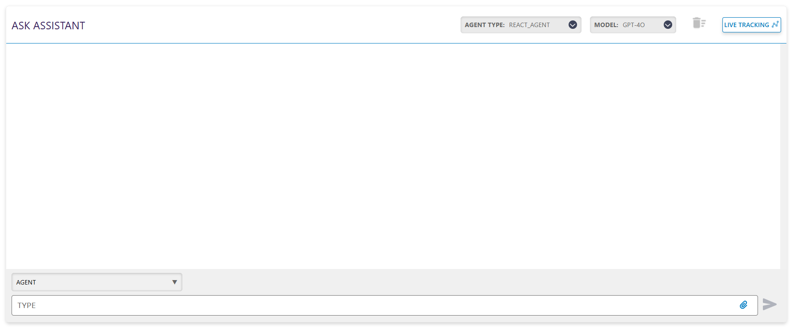
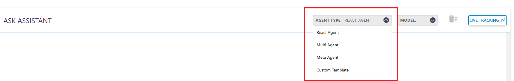
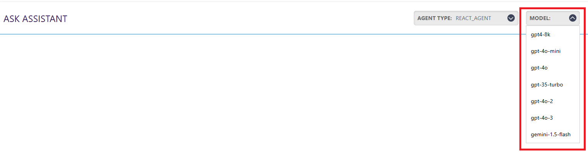
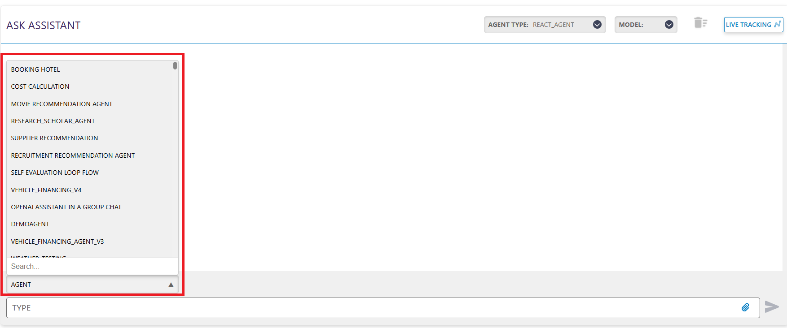

# Inference

## What is Inference?

Inference is the section where you can interact with the agents you have created through a chat interface. It allows you to select and model, initiate a conversation, and observe how the agent responds bsed on its reasoning.

## Steps to onboard Agent in Inference
This guide walks you through the steps required to run an inference using our framework.

<h2 style="color: black;">Step 1: Select an Agent Type</h2>

From the dropdown menu, choose the agent type.

Available Agent Types:

- **React Agent**
- **Multi Agent**
- **Meta Agent**
- **Custom Agent**

<h2 style="color: black;">Step 2: Select a Model Type</h2>

After selecting the agent type, pick a model type that the agent will use.

Available Model Types:

- **GPT4-8k**
- **GPT-4o-mini**
- **GPT-4o**
- **GPT-4o-2**
- **GPT-4o-3**
- **Gemini-1.5-Flash**

<h2 style="color: black;">Step 3: Select the Agent</h2>

Finally, choose the specific agent from the dropdown.

## React Agent Inference

**[React Agent](reactAgent_inference.md)**
The React Agent inference is a simple chat window where you can chat with the agent you have onboarded and can see the steps taken by the agent to answer your queries.

## Multi Agent Inference

**[Multi Agent](multiAgent_inference.md)**
In the Multi Agent Inference setup, we offer a **Human-in-the-Loop** option. This feature allows users to review and approve each step the agent plans to execute before it proceeds. 

## Meta Agent Inference

**[Meta Agent](metaAgent_inference.md)**
The Meta Agent inference offers a chat interface similar to the React Agent. It allows you to interact with the onboarded agent and view the steps it takes to process your queries, providing transparency into its decision-making process.
