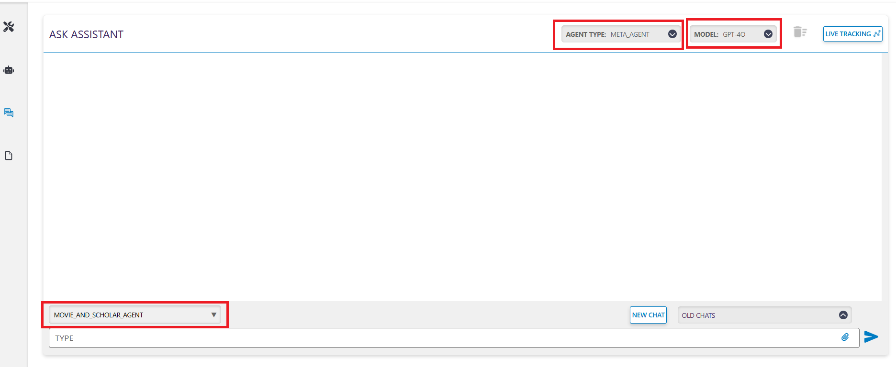
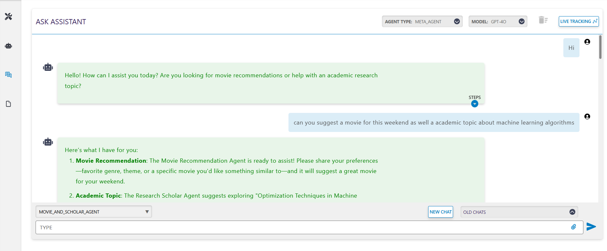
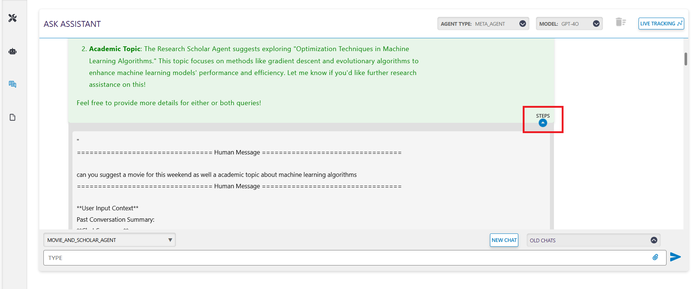
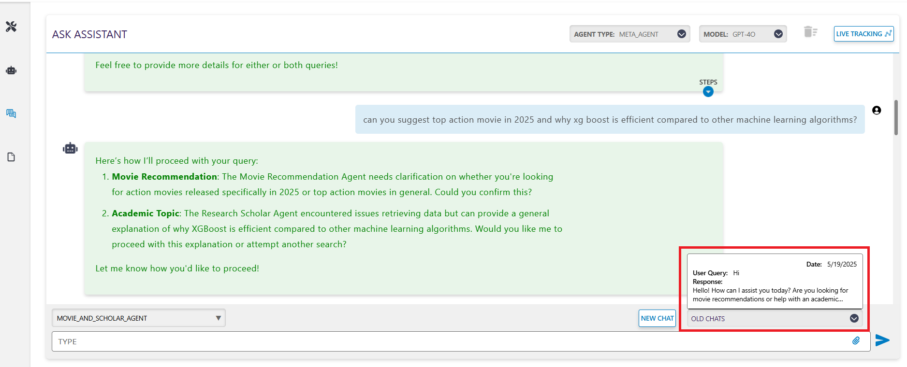

# Meta Agent Inference

The Meta Agent inference setup provides a simple chat interface where you can interact with the onboarded agent and observe the steps it takes to answer your queries.

**Meta Agent Inference Window**: 

Select the Meta Agent template, model, and agent name to begin interacting with the agent.  
 

## Examples of Chat Screens for a Movie_and_scholar_Agent
<h2 style="color:black;">Inference Results</h2>

Below is the sample chat interaction showcasing the inference process:

  
 

## Steps Taken by the Agent
- You can view the steps taken by the agent to answer your query by clicking the "Steps" dropdown.  
- These steps reveal the agents the meta agent calls based on the user query, providing transparency into the decision-making process.

## Retrieving Old Chats
- Retrieve your old chats by selecting them from the "Old Chats" dropdown.
- This feature allows you to revisit previous conversations with the agent for reference or analysis.

