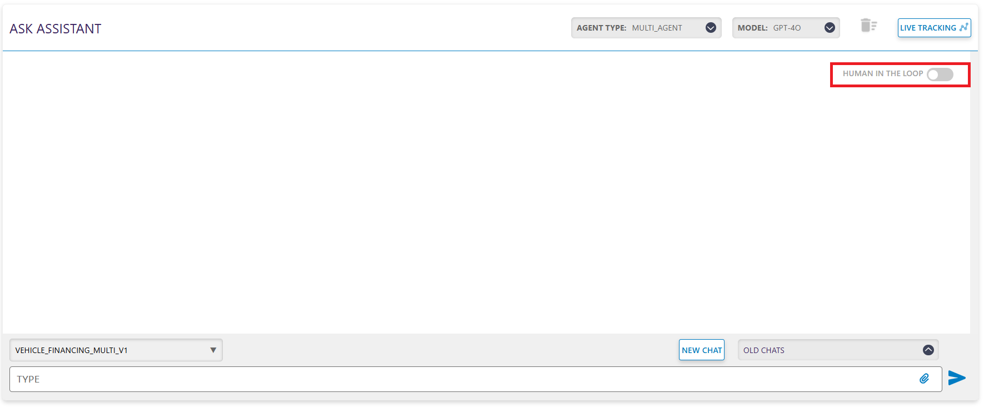

# Multi Agent Inference

In the Multi Agent Inference setup, we offer a **Human-in-the-Loop** option. This feature allows users to review and approve each step the agent plans to execute before it proceeds. It ensures greater control, transparency and safety during the agent's decision-making process.

## Inference with Human in the Loop

Toggling on the **Human-in-the-Loop** button, invokes the agent to provide a detailed plan about the steps it will perform to execute the tasks. 

After the agent provides the plan, it will ask for your approval or your feedback.

The **thumbs-up** button is the approval button. Clicking on this button, you will approve the plan proposed by the agent and the agent will execute your query. 

The **thumbs-down** button is the feedback button. Clicking on the button, will ask you to provide your feedback for the plan generated by the agent. The agent will regenerate the plan according to your feedback.

You can see the critic score of the response by clicking the "Steps" dropdown.

