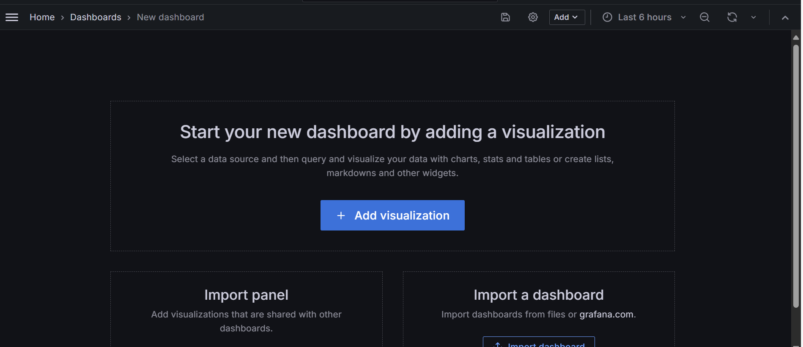

# Connecting to Grafana and Creating Visualizations from Elasticsearch

This guide will walk you through the process of connecting Grafana to your Elasticsearch data source, configuring it, and creating visualizations and dashboards. Each step is broken down to help you set up the integration seamlessly.

## 1. **Provide Elasticsearch Endpoint URL for Connection**

To begin, you must specify the **Elasticsearch Endpoint URL**. This URL is where Grafana will look for your Elasticsearch instance. Grafana needs this URL to establish a connection and retrieve data from Elasticsearch.

**Steps:**

- Open Grafana and navigate to the **Data Sources** section.
- Select **Add Data Source**, then choose **Elasticsearch** from the list of available sources.
- In the **HTTP URL** field, enter the endpoint URL of your Elasticsearch instance.
- Click **Save & Test** to verify the connection.

Once the connection is successful, Grafana will confirm that the endpoint is accessible and can pull data from your Elasticsearch server.

## 2. **Provide Elasticsearch Details**

After establishing the connection, you need to configure the details specific to your Elasticsearch data. These include the **Index Name**, **Message Field Name**, and **Level Field Name**.

- **Index Name**: The index name should exactly match the one defined in your Elasticsearch configuration. It tells Grafana which index to pull data from within your Elasticsearch cluster. If you have multiple indices or time-based indices (e.g., `agentic-foundry-tool-log`), specify the exact name or pattern here.
  
- **Message Field Name**: This refers to the field in the Elasticsearch index that contains the actual log message or data content that you want to visualize in Grafana. For example, this might be `message` or `log` depending on your Elasticsearch mappings.

- **Level Field Name**: The level field represents the severity level of logs or events, such as `INFO`, `WARN`, `ERROR`, or any custom field you use for classification. Ensure the field you provide matches the one used in your Elasticsearch index for filtering and aggregation.

**Steps:**

- In Grafana's **Data Source** configuration page, you’ll see fields for **Index Name**, **Message Field**, and **Level Field**.
- Fill in the respective names that match your Elasticsearch configuration.
- After entering the information, click **Save & Test** again to ensure everything is set up correctly.

Once saved, Grafana will store these details and use them to pull the correct data during visualizations and dashboard creation.

## 3. **Adding Visualizations**

With the connection established and data source configured, you are now ready to add visualizations to your Grafana dashboard. Visualizations are charts, graphs, or tables that will display your data in meaningful ways.

**Steps:**

- From the Grafana homepage, click on the **Plus (+)** symbol located on the left-hand sidebar.
- Select **Dashboard** from the options that appear.
- A new, empty dashboard will open. Click on **Add new panel**.
- In the panel configuration page, select the **Data Source** you created in Step 2.
- Choose a visualization type (e.g., **Graph**, **Time series**, **Table**, etc.).
- Grafana will automatically query Elasticsearch using the configured **Index Name** and fields and display the results in the chosen visualization format.

Once you’ve configured your panel, click **Save** to add it to your dashboard. You can repeat this process to add multiple visualizations to your dashboard, each representing different aspects of your data.

After adding a data source, the dashboard will be updated to display the newly integrated data. From here, you can create a wide range of visualizations based on the available data.

**Additional Configurations:**

- **Filters**: Grafana allows you to use **Filters** to narrow down the data displayed. For example, you can filter logs by date, severity level, or specific keywords.
- **Variables**: You can define **Variables** (e.g., `session_id`, `action_id`, or `action_on`) that can be used as dynamic filters across multiple panels. This allows for interactive and flexible dashboards where users can change the value of a variable and see the dashboard update accordingly.

## 4. **Filters and Variables**
To make your dashboards more dynamic, Grafana supports the use of **Filters** and **Variables**. These allow you to control what data is displayed in real-time, making it easy to customize and adjust visualizations on the fly.

**Filters:**
Filters are conditions that can be applied to specific fields in the Elasticsearch index. They are especially useful for narrowing down data, such as:

- Displaying only logs from a particular time range.
- Filtering logs based on severity level (e.g., showing only `ERROR` logs).
- Displaying data related to specific services or hosts.

**Variables:**
Variables in Grafana let you create dynamic dashboards that can adapt based on user input. Once a variable is defined, it can be used in the queries that power your visualizations. This makes it easy for users to filter data on the fly without modifying the queries directly.

**Steps:**

- Navigate to **Dashboard Settings** (the gear icon on the top-right corner of your dashboard).
- Select **Variables** from the menu.
- Create a new variable (e.g., `Host`, `Service`, `Log Level`) and define its options (e.g., available hosts or log levels).
- Use this variable in your queries to make your dashboards more interactive.

For example, you could create a variable `Host` that lets users select the host from a dropdown, and the graphs on the dashboard will automatically update to show data for that selected host.

## 5. **Sample Final Dashboard**
Once all the visualizations are configured, your Grafana dashboard should look something like the following example, where you can interact with various filters, variables, and different types of graphs.
  
**Final Output:**

By using the **Filters** and **Variables**, users can interactively explore the data, focusing on different aspects like time periods, severity levels, and specific hosts or services.

**Dashboard Severity Filter Options**

In the final dashboard, we have additional filtering capabilities under the **Severity** section. Instead of selecting all severity levels at once, users can filter and view the dashboard data separately based on the following four options:

- **Error**
- **Debug**
- **Info**
- **Warn**

