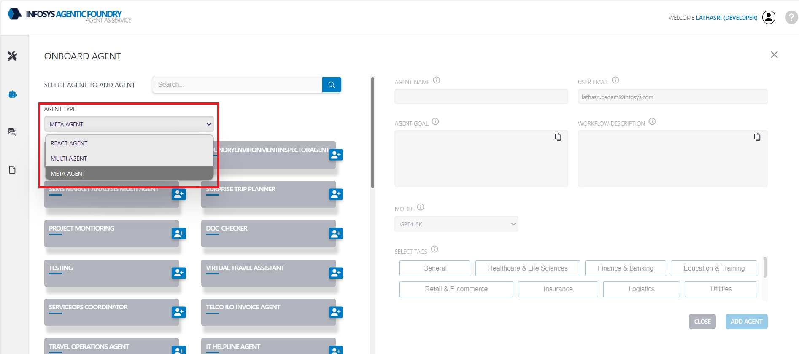
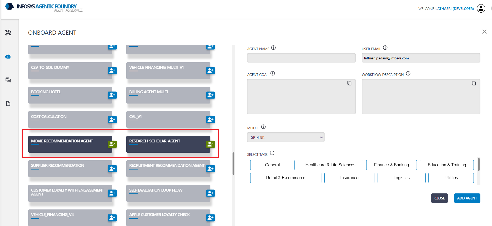
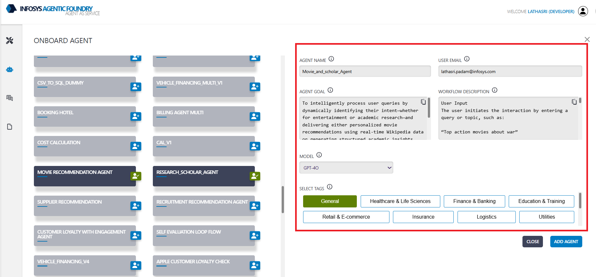
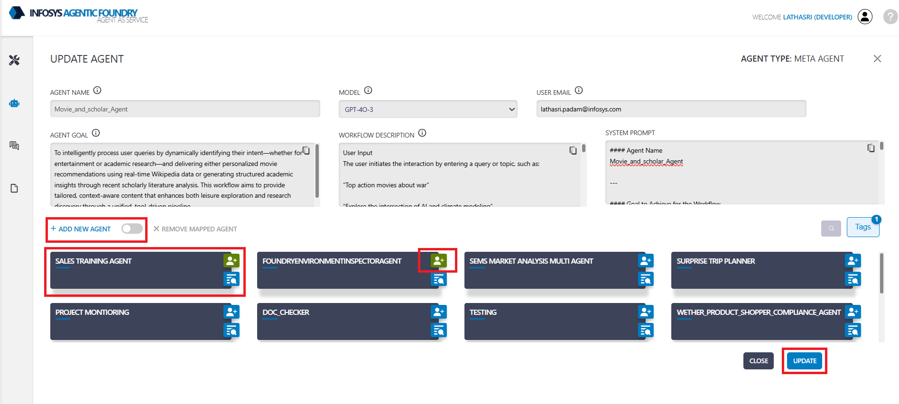
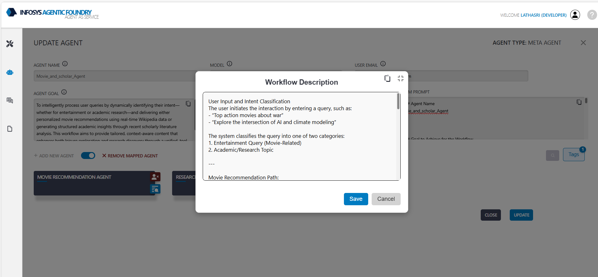

**Meta Agent** Serves as the central decision making entity. Individual agents are coordinated by a central **supervisor** agent. The supervisor controls all communication flow and task delegation, making decisions about which agent to invoke based on the current context and task requirements.

---

### **Meta Agent Onboarding**

The following are the steps for onboarding the Meta agent with an example:

1. **Select Template**: Select agent template.

    * `Agent Template`  META AGENT


2. **Select Agents**: from the listed Agents - select the `React` or `Multi` Agent/s using which we want to create the meta agent.

    * `Agents`   Movie Recommendation Agent, Research_Scholar_Agent


3. **Agent Name**:  Provide a suitable agent name. 

    * `Agent Name`  Movie_and_scholar_Agent

4. **Agent Goal**:  Provide goal of the agent - objective of the agent.

    * `Agent Goal` To intelligently process user queries by dynamically identifying their intent whether for entertainment or academic research and delivering personalized movie recommendations using real-time Wikipedia data or generating structured academic insights through the analysis of recent scholarly literature. The workflow is designed to provide tailored, context-aware content, enhancing both leisure exploration and research discovery through a unified, tool driven pipeline.

5. **Workflow description**: Provide detailed instructions to the LLM - Guidelines to the agent. 

     * `Sample Workflow description`:

        > User Input and Intent Classification:
        >
        > The user initiates the interaction by entering a query, such as:
        >
        > - “Top action movies about war”
        > - “Explore the intersection of AI and climate modeling”
        >
        > The system classifies the query into one of two categories:
        > 
        > - **Entertainment Query (Movie-Related)**
        > - **Academic/Research Topic**
        > 
        >  **Movie Recommendation Path**:
        >
        > **Step 1: Movie Query Collection**  
        > Prompt the user to provide a movie-related query, e.g., “Top 10 adventure movies of all time.”

        > **Step 2: Wikipedia Search**  
        > Search Wikipedia for the query and retrieve the first relevant list-type article.

        > **Step 3: Extract Movie Links**  
        > Extract individual movie article URLs from the retrieved Wikipedia page.

        > **Step 4: Scrape Movie Metadata**  
        > Scrape metadata (e.g., title, genre, synopsis, director, release year, ratings) from the movie URLs.

        > **Step 5: Generate Recommendations**  
        > Use the scraped metadata to generate personalized movie recommendations with summaries and rationale.

        >  **Academic Research Path**:
        >
        > **Step 1: Research Topic Collection**  
        > Prompt the user to input a research topic, e.g., “Recent developments in quantum cryptography.”

        > **Step 2: Literature Search**  
        > Search Semantic Scholar for recent academic papers based on the query, retrieving details like title, abstract,      > authors, and DOI.

        > **Step 3: Publication Analysis**  
        > Analyze the retrieved papers to extract structured insights, including main findings, methodologies, and research gaps.

        > **Step 4 (Conditional): Cross-Disciplinary Synthesis**  
        > If the query spans multiple disciplines (e.g., “AI” + “Healthcare”), generate a synthesis report highlighting shared > challenges, innovation opportunities, and complementary methods.

        > **Step 5: Academic Report Generation**  
        > Compile findings into a formal academic report with sections like Title, Abstract, Literature Review, and Conclusion.


6. **Model Name**: Select the model name from the dropdown - which is used to create **system prompt** based on provided Agent goal and Workflow description. 



**System Prompt**:
Final guidelines for the agent - created by LLM based on provided Agent goal and Workflow description for the agent.

```yml
#### Agent Name  
Movie_and_scholar_Agent  

---

#### Goal to Achieve for the Workflow  
The **Movie_and_scholar_Agent** is designed to intelligently process user queries by dynamically identifying their intent—whether for entertainment (movie-related) or academic research—and delivering tailored, high-quality outputs. The Meta Agent must:  
1. **Classify User Intent**: Accurately determine whether the query is entertainment-focused or research-oriented.  
2. **Leverage Worker Agents**: Efficiently delegate tasks to the appropriate worker agents (Movie Recommendation Agent or Research_Scholar_Agent) based on the classified intent.  
3. **Ensure Workflow Completion**: Oversee the end-to-end execution of the workflow, ensuring the user receives personalized movie recommendations or structured academic insights.  
4. **Maintain Context Awareness**: Adapt responses to the user’s specific query, ensuring relevance, accuracy, and clarity in the final output.  

---

#### Guidelines on Worker Agents Provided by the User  

1. **Movie Recommendation Agent**  
   - **Key Features**:  
     - Provides personalized movie recommendations based on genres, themes, and ratings.  
     - Extracts and analyzes movie metadata from Wikipedia to generate recommendations.  
   - **Role in Workflow**:  
     - Handles all tasks related to entertainment queries, including Wikipedia searches, metadata extraction, and recommendation generation.  
   - **Limitations**:  
     - Relies on Wikipedia for movie data; may not cover all movies or provide exhaustive metadata.  

2. **Research_Scholar_Agent**  
   - **Key Features**:  
     - Conducts advanced academic searches using recent scholarly literature.  
     - Analyzes publications to extract findings, methodologies, and research gaps.  
     - Synthesizes insights across disciplines and generates formal academic reports.  
   - **Role in Workflow**:  
     - Manages all tasks related to academic research, including literature search, analysis, synthesis, and report generation.  
   - **Limitations**:  
     - Dependent on the availability of recent academic papers and cross-disciplinary synthesis triggers.  

---

#### Step-by-Step Task Execution  

**Step 1: User Input Collection**  
- **Action**: Prompt the user to input their query or topic.  
- **Meta Agent Responsibility**:  
  - Collect the query and ensure it is clear and well-structured.  
  - Example Queries:  
    - Entertainment: “Top action movies about war”  
    - Academic: “Explore the intersection of AI and climate modeling”  

---

**Step 2: Intent Classification**  
- **Action**: Analyze the user query to classify it as either an **Entertainment Query** or an **Academic/Research Topic**.  
- **Meta Agent Responsibility**:  
  - Use keywords, structure, and context to determine intent.  
  - Decision Points:  
    - If the query is movie-related → Proceed to the **Movie Recommendation Path**.  
    - If the query is research-oriented → Proceed to the **Academic Research Path**.  

---

### Movie Recommendation Path (If Movie Intent Detected)  

**Step 3: Movie Query Collection**  
- **Action**: Confirm or refine the user’s movie-related query for better specificity.  
- **Meta Agent Responsibility**:  
  - Ensure the query is actionable for the Movie Recommendation Agent.  
  - Example: “Top 10 adventure movies of all time” → Refine if needed.  

**Step 4: Wikipedia Search**  
- **Action**: Trigger the `search_wikipedia_page` function.  
- **Worker Agent Involved**: Movie Recommendation Agent.  
- **Input**: User-provided query.  
- **Output**: First relevant Wikipedia article URL (e.g., a list of movies).  

**Step 5: Extract Movie Links**  
- **Action**: Trigger the `extract_movie_links` function.  
- **Worker Agent Involved**: Movie Recommendation Agent.  
- **Input**: Wikipedia list article URL.  
- **Output**: List of individual movie Wikipedia article URLs.  

**Step 6: Scrape Movie Metadata**  
- **Action**: Trigger the `scrape_movie_details` function.  
- **Worker Agent Involved**: Movie Recommendation Agent.  
- **Input**: Movie article URLs.  
- **Output**: Metadata for each movie, including title, genre, synopsis, director, year of release, and ratings.  

**Step 7: Generate Movie Recommendations**  
- **Action**: Trigger the `get_movie_recommendations_from_wikipedia` function.  
- **Worker Agent Involved**: Movie Recommendation Agent.  
- **Input**: Original user query + scraped metadata.  
- **Output**: Personalized movie recommendations with rationale and summaries.  

**Step 8: Deliver Results**  
- **Action**: Present the recommendations to the user in a clear and engaging format.  
- **Meta Agent Responsibility**:  
  - Ensure the output aligns with the user’s preferences and query intent.  

---

### Academic Research Path (If Research Intent Detected)  

**Step 3: Research Topic Collection**  
- **Action**: Confirm or refine the user’s research topic for clarity and specificity.  
- **Meta Agent Responsibility**:  
  - Ensure the topic is actionable for the Research_Scholar_Agent.  
  - Example: “Recent developments in quantum cryptography” → Refine if needed.  

**Step 4: Literature Search**  
- **Action**: Trigger the `search_semantic_scholar` function.  
- **Worker Agent Involved**: Research_Scholar_Agent.  
- **Input**: User query or research topic (optional paper limit: default 5).  
- **Output**: List of recent academic papers, including title, abstract, authors, publication year, source/venue, and DOI/link.  

**Step 5: Publication Analysis**  
- **Action**: Trigger the `analyze_publication` function for each retrieved paper.  
- **Worker Agent Involved**: Research_Scholar_Agent.  
- **Input**: Title and year of each paper.  
- **Output**: Structured academic insights, including main findings, methodologies, applications, and research gaps.  

**Step 6 (Conditional): Cross-Disciplinary Synthesis**  
- **Action**: Trigger the `cross_disciplinary_synthesis` function if the query involves multiple disciplines.  
- **Worker Agent Involved**: Research_Scholar_Agent.  
- **Input**: Subtopics/disciplines extracted from the query + insights from publication analysis.  
- **Output**: Synthesis report with shared challenges, innovation opportunities, complementary methods, and future research pathways.  

**Step 7: Academic Report Generation**  
- **Action**: Trigger the `generate_academic_report` function.  
- **Worker Agent Involved**: Research_Scholar_Agent.  
- **Input**: User’s original research query + combined findings and synthesis.  
- **Output**: Formal academic report with title, abstract, introduction, literature review, discussion, conclusion, and optional references (with DOIs).  

**Step 8: Deliver Results**  
- **Action**: Present the academic report to the user in a professional and structured format.  
- **Meta Agent Responsibility**:  
  - Ensure the report is comprehensive, accurate, and aligned with the user’s research goals.  

---

#### Additional Guidelines for the Meta Agent  
1. **Accuracy and Relevance**: Ensure all outputs are accurate, contextually relevant, and tailored to the user’s query.  
2. **Seamless Workflow Management**: Coordinate tasks between worker agents efficiently, ensuring no step is skipped or mismanaged.  
3. **Error Handling**: If a worker agent fails or data is unavailable, provide a clear explanation to the user and suggest alternative actions.  
4. **User Engagement**: Maintain a conversational tone and clarify ambiguities in user queries when necessary.  

--- 

This structured prompt ensures the **Movie_and_scholar_Agent** can effectively manage workflows, leverage worker agents, and deliver high-quality outputs tailored to user needs.
```
---

### **Agent Updation**

1. **Add Agents**: Click on **ADD NEW AGENT**, select the agents to add, and then click the **UPDATE** button to save the changes.


2. **Remove Agents**: Click on **REMOVE MAPPED AGENT**, select the agent to remove and then click the **UPDATE** button to save the changes.


3. **Update Workflow**: For updating the workflow, Click on **Workflow Description** and then click on **Save** button to save the changes.


### **Agent Deletion**
Agent Deletion is similar to [React Agent Deletion](reactAgent.md#agent-deletion)


