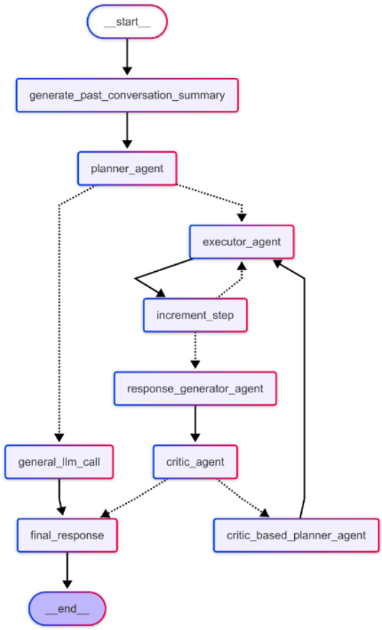

# Multi Agent Configuration

The **Multi Agent** operates on the `Planner-Executor-Critic` paradigm. It begins with a `Planner Agent` that generates a step-by-step plan based on the user query. The `Executor Agent` then executes each step of the plan. The `Critic` evaluates the outputs by scoring the results of each step.

<!-- #### **Multi AI Agent**

  

    
    
<strong>Multi Agent Without Feedback</strong>

  

  

    
    
<strong>Multi Agent With Feedback</strong>

  

 -->

### **Multi Agent Onboarding**

To onboard a Multi Agent, users begin by selecting the MULTI AGENT template and choosing their desired tools such as get_weather. Must provide an agent name like "Weather Agent" and define the agent goal, for example "This agent provides personalized suggestions based on real-time weather data." 

A detailed workflow description with guidelines for the LLM is essential, outlining the step-by-step process the agent should follow. Users then select the model name from the dropdown menu, which generates system prompts based on the provided agent goal and workflow description.

!!! info "Sample Workflow description"

    Understand the user intent and perform following steps:

    1. Retrieve Weather Data - Make an API call to fetch real-time weather data.
    2. Analyze Weather Conditions - Evaluate the weather data to determine current conditions.
    3. Generate Recommendations - Based on the analysis, provide personalized suggestions to the user.

    For example:

    If the weather is pleasant, suggest outdoor activities.
    If the weather is rainy or stormy, advise the user to carry an umbrella or avoid traveling.
    If extreme weather conditions are detected, recommend staying indoors and taking necessary precautions.

Select the model name from the dropdown - which is used to create `system prompt` based on provided Agent goal and Workflow description. 

**System Prompt**:

Using the provided agent goal and workflow description, LLM generates system prompts for the planner, executor, and critic agents within a multi-agent template.

---

### **Agent Updation**

Agent Updation is similar to [React Agent Updation](reactAgent.md#agent-updation)

### **Agent Deletion**

Agent Deletion is similar to [React Agent Deletion](reactAgent.md#agent-deletion)

!!! warning "Important"
    Only the original creator of the agent has permission to update or delete it. Other users do not have access to modify or remove these resources.