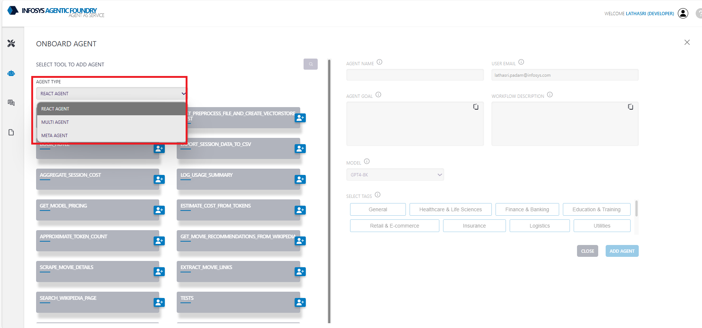
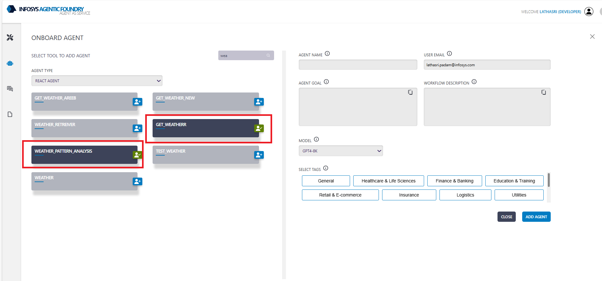
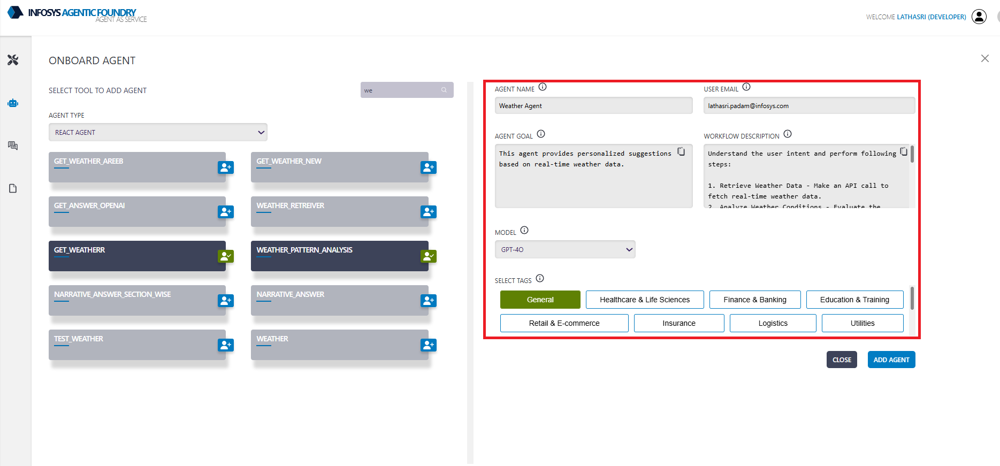
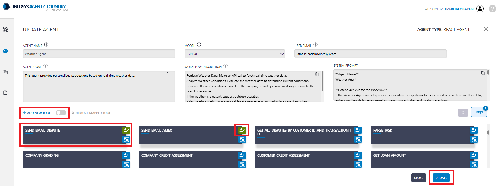
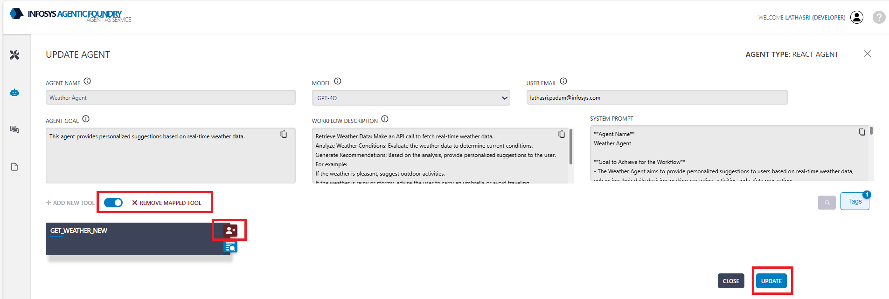
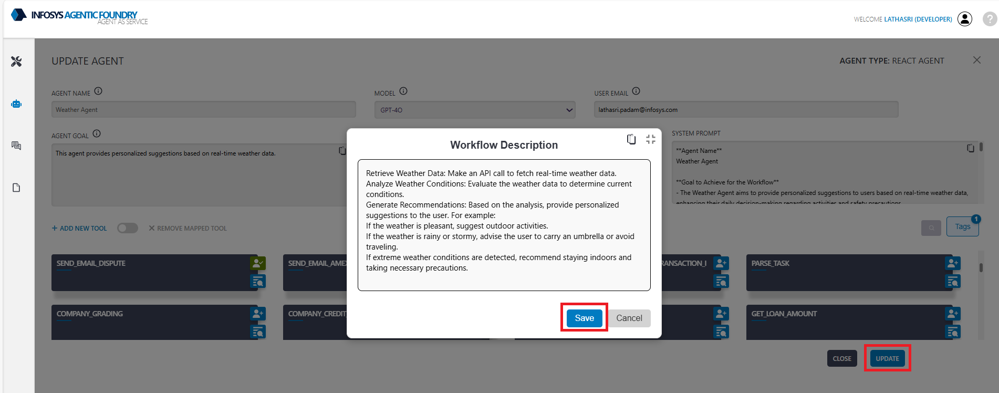
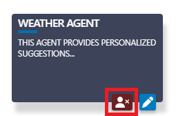
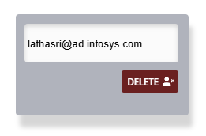

The **ReAct(Reasoning and Acting)** agent combines reasoning traces with action execution. It uses a step by step thought process to determine what tool to use, executes it, observe the result, and continues until it can return a final answer.

---

### **React Agent Onboarding**

The following are the steps for onboarding the React agent with an example:

1. **Select Template**: Select agent template.

    * `Agent Template`  REACT AGENT

2. **Select Tools**: from the listed tools - select the tool/s using which we want to create the agent.

    * `Tools`   get_weather

3. **Agent Name**:  Provide a suitable agent name. 

    * `Agent Name`  Weather Agent

4. **Agent Goal**:  Provide goal of the agent - objective of the agent.

    * `Agent Goal` This agent provides personalized suggestions based on real-time weather data.

5. **Workflow description**: Provide detailed instructions to the LLM - Guidelines to the agent. 

     * `Sample Workflow description`:

        > Understand the user intent and perform following steps:
        >
        > 1. Retrieve Weather Data - Make an API call to fetch real-time weather data.
        > 2. Analyze Weather Conditions - Evaluate the weather data to determine current conditions.
        > 3. Generate Recommendations - Based on the analysis, provide personalized suggestions to the user. 
        >
        >  For example:
        >  If the weather is pleasant, suggest outdoor activities.
        >  If the weather is rainy or stormy, advise the user to carry an umbrella or avoid traveling.
        >  If extreme weather conditions are detected, recommend staying indoors and taking necessary precautions.

6. **Model Name**: Select the model name from the dropdown - which is used to create **system prompt** based on provided Agent goal and Workflow description. 

**System Prompt**:
Final guidelines for the agent - created by LLM based on provided Agent goal and Workflow description for the agent.

> **Agent Name**  
Weather Agent

> **Goal to Achieve for the Workflow**  
- The Weather Agent aims to provide personalized suggestions to users based on real-time weather data, enhancing their daily decision-making regarding activities and safety precautions.

> **Guidelines on Tools Provided by the User**  
- **Tool Name:** get_weather_new  
- **Key Functionalities:** This tool retrieves real-time weather data for a specified city using the OpenWeatherMap API. It provides details such as temperature, humidity, pressure, and a brief weather description.
- **Limitations:** The tool requires a valid API key and city name to function. It returns an error message if the HTTP request fails, indicating potential issues with network connectivity or incorrect parameters.

> **Step-by-Step Task Description**  
1. **Retrieve Weather Data:**  
- Use the `get_weather_new` tool to make an API call with the provided API key and city name.
- Ensure the tool successfully fetches the weather data, including temperature, humidity, pressure, and weather description.

> 2. **Analyze Weather Conditions:**  
- Evaluate the retrieved weather data to determine current conditions.
- Identify key weather attributes such as temperature range, humidity levels, and specific weather phenomena (e.g., rain, storm).

> 3. **Generate Recommendations:**  
- Based on the analysis, provide personalized suggestions to the user:
    - If the weather is pleasant, suggest outdoor activities.
    - If the weather is rainy or stormy, advise the user to carry an umbrella or avoid traveling.
    - If extreme weather conditions are detected, recommend staying indoors and taking necessary precautions.

> **Additional Relevant Information**  
- The agent should ensure the recommendations are timely and relevant to the user's location and current weather conditions.
- In case of tool failure or unavailability, the agent should inform the user of the inability to provide weather-based suggestions and recommend checking weather updates through other means.

---

### **Agent Updation**

1. **Add Tools**: Click on **ADD NEW TOOL**, select the tools to add, and then click the **UPDATE** button to save the changes.

2. **Remove Tools**: Click on **REMOVE MAPPED TOOL**, select the tool to remove and then click the **UPDATE** button to save the changes.

3. **Update Workflow**: For updating the workflow, Click on **Workflow Description** and then click on **Save** button to save the changes.

### **Agent Deletion**
You must provide the creator's email address to delete the agent.

