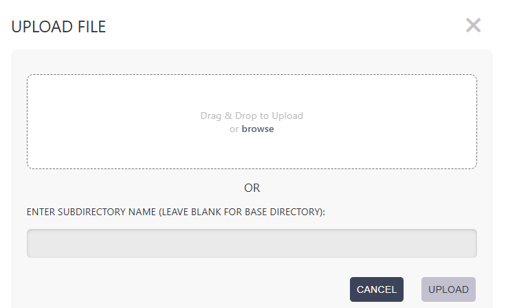
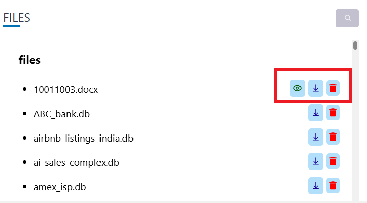

# Files

This section is used to upload different types of files that may be required by the tools to perform its operation. This may include files such as Database Files (.db),Excel Sheets (.xlsx), Word Documents 
(.docx), PDF Files (.pdf) and any other files required by your agent.

**Supported database files include SQLite (.db, .sqlite) and PostgreSQL dump files (.sql).**

## Uploading Files

- You can upload your files either by clicking the "Browse" button or drag and drop the files in the "Upload" window. 
- After uploading, all files will be saved in the `user_uploads` directory.  
- To access a file through any tool, use the path format: `user_uploads/filename.extension`.

## Viewing, Downloading and Deleting Files

You can iew the uploaded files and download the uploaded files and delete the uploaded files by clicking on the "View", "Download" and "Delete" button in the "Files" section.

