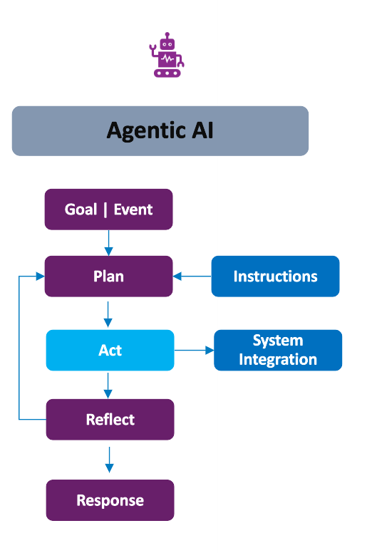

# Welcome to Agentic Foundry
**Agentic Foundry** is an open-source framework designed to empower developers to create, configure, and deploy customizable AI agents. By using predefined templates, this platform ensures seamless tool integration and streamlines agentic workflow development.

## What is Agentic Foundry
The `Agentic Foundry` enables the efficient creation and deployment of AI agents by offering customizable templates and a set of powerful tools. These agents can be tailored to specific roles and personas, and developers can integrate their own custom tools to suit various needs.

**Key Components:**

**1. Agents**

Agents are the core building blocks of Agentic Foundry. An agent is an autonomous AI entity configured with a specific role, persona, and set of instructions that define how it reasons, plans, and acts. Agents receive user queries, determine the best course of action, invoke tools or external services, and return structured responses.

The platform provides below agent templates, each designed for a different workflow pattern:

| Template | Description |
|---|---|
| **React** | Single-task reasoning with step-by-step tool execution |
| **React Critic** | Adds self-critique to React for improved output quality |
| **Multi Agent** | Collaborative planning and execution across specialized agents |
| **Planner Executor** | Separates planning from execution with replanning support |
| **Meta** | Orchestrator that dynamically coordinates worker agents |
| **Planner Meta** | Advanced orchestrator with multi-prompt planning and delegation |
| **Hybrid** | Combines reasoning and collaborative strategies adaptively |

[:material-pencil-ruler: Agent Design](Agents_Design/overview.md){ .md-button .md-button--primary }
[:material-cog: Agent Configuration](agent_config/Overview.md){ .md-button }
[:material-chat-processing: Inference](Inference/inference.md){ .md-button }

**Supporting Components**

Each agent can be equipped with the following components to extend its capabilities:

=== "Tools"

    Reusable code functions that give agents the ability to perform actions — call APIs, query databases, send emails, and more. Tools are onboarded through the platform with built-in validation and testing to ensure quality, security, and reliability before deployment.

    [:material-wrench: Tools Configuration](tools_config/tools.md){ .md-button }

=== "Validators"

    Custom validation logic — similar to tools — mapped to agents during onboarding. When enabled, validators automatically check agent responses against expected patterns, returning a validation score, status, and feedback to improve response quality in real time.

    [:material-shield-check: Validators](Inference/inference.md#2-validators){ .md-button }

=== "MCP Servers"

    External tool and service connections via the Model Context Protocol. Register local, remote, or file-based MCP servers for real-time tool discovery, enterprise security, approval workflows, and audit logging.

    [:material-connection: MCP Registry](MCP_Registry.md){ .md-button }

=== "Knowledge Bases"

    Domain-specific document repositories (PDF, TXT) that agents reference during inference. Upload documents from the Tool page and select one or more knowledge bases in the chat interface for accurate, context-aware answers.

    [:material-book-open-variant: Knowledge Base](Knowledge_Base.md){ .md-button }

---

**2. Agent Pipelines**

Agent Pipelines allow you to orchestrate multiple agents into complex, multi-step workflows using a visual drag-and-drop builder. Instead of manually coordinating agent calls, you define a pipeline that automatically routes data between agents based on your configured flow — with conditional branching, input/output management, and reusable configurations.

[:material-pipe: Agent Pipelines](Agent_Pipelines.md){ .md-button .md-button--primary }

---

## How Agentic AI Differs from Traditional Software and GenAI

<!--  -->

    

**Traditional Systems:**

Traditional softwares including process automation, supervised machine learning (ML), and even generative AI lacks true autonomy. These systems perform only the tasks they are explicitly programmed or trained to do. They follow predefined instructions or generate outputs within defined parameters.

**What Makes Agentic AI Different:**

Agentic AI is designed to operate with autonomy. Rather than executing predefined tasks, it receives high-level goals or events as input and independently determines how to act in order to achieve the desired outcomes.

**Core Mechanisms of Agentic AI:**

Agentic AI integrates key capabilities to enable autonomous behavior:

- **Plan:** Develops a strategy to achieve the given goal or respond to an event.
- **Act:** Executes tasks and may interact with external systems or tools to carry out its strategy.
- **Reflect:** Evaluates the outcomes of its actions, learns from them, and adjusts its behavior accordingly.
- **Respond:** Delivers a final decision or result based on its planning and learning process.

**Key Characteristics:**

The output of an Agentic AI system is:

- **Goal-directed**  
- **Interactive**  
- **Context-aware**

---

## Why to Use Agentic Foundry
 
The `Agentic Foundry`  offers a comprehensive solution with continually evolving new features:
 
**1. Agent-as-a-Service:**
     Open-source framework-based solution that allows users to quickly configure agents and tools. End-users can interact with agents via a conversational interface.
 
**2. Vertical Agents:**
A suite of agents tailored for various industry personas. These agents represent specific workflows for different domains, including:

   * `Finance:`
      - Financial statement analysis
      - Risk assessment and management
      - Fraud prevention

   * `Healthcare:`
      - Medical record analysis
      - Diagnostic assistance
      - Treatment plan recommendation

   * `Insurance:`
      - Policy underwriting assistance
      - Claim fraud detection
      - Risk assessment for policy pricing

   * `Retail:`
      - Customer segmentation
      - Personalized product recommendations
      - Price optimization

   * `Communication:`
      - Customer churn prediction
      - Fraud detection in calls and data usage
      - Customer service automation
   
   * `Manufacturing:`
      - Quality control inspection
      - Predictive maintenance
      - Product lifecycle management
   
The following are sample use cases categorized by domain:

  
Finance

  <ul>
    <li>Customer Onboarding</li>
    <li>Credit Worthiness Assessment</li>
    <li>Personal Finance Advisor</li>
  </ul>

  
Healthcare

  <ul>
    <li>Personalized care plan</li>
    <li>E-Triage</li>
    <li>Medical translator</li>
  </ul>

  
Insurance

  <ul>
    <li>Personalized insurance quotes & underwriting</li>
    <li>Improve conversion ratio by AI assisted AI</li>
    <li>Reduce CSR call efforts</li>
  </ul>

  
Retail

  <ul>
    <li>Customer segmentation</li>
    <li>Supplier recommendation</li>
    <li>Competitor Product Analysis</li>
  </ul>

  
Travel

  <ul>
    <li>Travel Operations</li>
    <li>Intelligent accommodation systems</li>
    <li>Travel Inspirational Video</li>
  </ul>

  
Manufacturing

  <ul>
    <li>Demand Forecasting</li>
    <li>Production Planning and Scheduling</li>
    <li>Energy Utilization Analytics</li>
  </ul>

 
**3. Horizontal Agents**

   - These agents offer common functionality across industries, such as:
      - Email sending
      - File search
      - Agentic RAG (Retrieval-Augmented Generation). 
      - SDLC

**4. Platform Capabilities**

   The framework goes beyond agent creation with a rich set of built-in platform features:

   * `Seven Agent Templates:` React, React Critic, Multi Agent, Planner Executor, Meta, Planner Meta, and Hybrid — each designed for different workflow patterns.
   * `Agent Pipelines:` Visual drag-and-drop builder for designing multi-agent workflows with conditional branching and reusable configurations.
   * `MCP Registry:` Model Context Protocol integration for connecting agents to external tools and services with real-time discovery and enterprise security.
   * `Memory Management:` Semantic memory for cross-session fact storage and episodic memory for few-shot learning from past conversations.
   * `Knowledge Base:` Upload PDFs and text documents as domain-specific knowledge sources for inference.
   * `Data Connectors:` Native connectivity to PostgreSQL, SQLite, MySQL, and MongoDB.
   * `Tool Validation:` Automated validation checklist ensuring code quality, security, and reliability before tool onboarding.
   * `Validators:` Custom response validation logic (similar to tools) that agents use to score, verify, and improve their own outputs in real time.
   * `Tool Interrupt:` Interactive mode to review, edit, and approve tool parameters step-by-step before execution.
   * `Canvas Screen:` Rich visualization of tables, charts, graphs, and images directly in the chat interface.
   * `Prompt Optimization:` Automated prompt evolution using Pareto sampling and LLM-as-judge scoring.
   * `Vault:` Secure secrets management with private and public vaults for API keys, URLs, and credentials.
   * `SSE Streaming:` Real-time streaming of agent execution steps to the UI as they happen.
   * `RBAC:` Role-based access control with Admin, Developer, and User roles.
   * `JWT Authentication:` Secure API endpoint authentication via Bearer tokens.
   * `Evaluation:` LLM-as-a-judge evaluation, ground-truth benchmarking, and consistency/robustness testing.
   * `Telemetry:` OpenTelemetry, Arize Phoenix, and Grafana for observability, tracing, and dashboards.
   * `Agent Export:` Export complete agent packages for backup, migration, or redeployment — including GitHub push support.
   * `Custom LLM Support:` Plug in additional LLM providers (Anthropic, Mistral, Groq, and more) alongside Azure OpenAI and OpenAI.
   * `GZIP Compression:` Automatic compression of large API responses for faster load times and reduced bandwidth.
   * `Time-To-Live (TTL):` Automated lifecycle management for memory records, tools, agents, and MCP servers with recycle bin support.

---
## How to Create and Use Agents

Follow these steps to set up your environment, create agents, and start using them:

**Step 1 — Set Up Secrets in Vault**
:   Store your API keys, database credentials, and service URLs — either in a private vault (personal) or a public vault (shared). Tools retrieve secrets by reference, so nothing is hardcoded.
:   [:octicons-arrow-right-24: Vault](Vault.md)

**Step 2 — Upload the Required Files**
:   Upload database files (`.db`, `.sqlite`, `.sql`), PDFs, and other supporting documents the agent will need during inference.
:   [:octicons-arrow-right-24: Files](files_upload/files.md)

**Step 3 — Connect Data Sources**
:   Connect to external databases (PostgreSQL, SQLite, MySQL, MongoDB) that agents can query during inference.
:   [:octicons-arrow-right-24: Data Connectors](DataConnectors.md)

**Step 4 — Create Knowledge Bases**
:   Upload PDFs or text documents as domain-specific knowledge sources for context-aware answers.
:   [:octicons-arrow-right-24: Knowledge Base](Knowledge_Base.md)

**Step 5 — Create and Onboard Tools**
:   Develop the required tools and onboard them through the platform. Every tool passes an automated validation checklist before onboarding.
:   [:octicons-arrow-right-24: Tools Configuration](tools_config/tools.md)

**Step 6 — Create Validators** *(Optional)*
:   Build custom validators that check agent responses against expected patterns. Map them to agents and enable the Validator toggle in chat.
:   [:octicons-arrow-right-24: Validators](Inference/inference.md#2-validators)

**Step 7 — Register MCP Servers** *(Optional)*
:   Register MCP servers (local, remote, or file-based) in the MCP Registry for real-time tool discovery.
:   [:octicons-arrow-right-24: MCP Registry](MCP_Registry.md)

**Step 8 — Create the Agent**
:   Build your AI agent by selecting a template (React, React Critic, Multi Agent, Planner Executor, Meta, Planner Meta, or Hybrid), adding tools, and configuring its role and persona.
:   [:octicons-arrow-right-24: Agent Configuration](agent_config/Overview.md)

**Step 9 — Build Agent Pipelines** *(Optional)*
:   For multi-agent workflows, use the visual builder to connect agents with conditional branching, input/output management, and reusable configurations.
:   [:octicons-arrow-right-24: Agent Pipelines](Agent_Pipelines.md)

**Step 10 — Start Using the Agent**
:   Select your agent in the Inference section and start querying. Use Canvas Screen for visualizations, Tool Interrupt for step-by-step control, and Knowledge Base selection for contextual answers.
:   [:octicons-arrow-right-24: Inference](Inference/inference.md)

**Step 11 — Evaluate and Monitor**
:   Benchmark agent performance with LLM-as-a-judge, ground-truth comparison, or consistency testing. Monitor system health with Telemetry via OpenTelemetry, Arize Phoenix, and Grafana.
:   [:octicons-arrow-right-24: Evaluation](Evaluation/evaluation_metrics.md) · [:octicons-arrow-right-24: Telemetry](Telemetry/telemetry.md)
 
 
---
 

    With <strong>Agentic Foundry</strong>, developers have the power to create highly customizable AI agents for various applications — empowering businesses and individuals to automate workflows and achieve efficiency with ease.

 
---

## Quick Navigation

-   :material-star-shooting:{ .lg .middle } **Features**

    ---

    Explore all platform capabilities at a glance — from agent templates to evaluation

    [:octicons-arrow-right-24: Explore Features](Features.md)

-   :material-download-circle:{ .lg .middle } **Installation**

    ---

    Set up Agentic Foundry on Windows, Linux, or Azure Kubernetes Service

    [:octicons-arrow-right-24: Installation Guide](Installation/windows.md)

-   :material-sitemap:{ .lg .middle } **Architecture**

    ---

    Understand the system design, component layers, and data flow

    [:octicons-arrow-right-24: Architecture Overview](Architecture.md)

-   :material-robot:{ .lg .middle } **Agent Design**

    ---

    Learn the design patterns behind all seven agent templates

    [:octicons-arrow-right-24: Agent Design](Agents_Design/overview.md)

-   :material-wrench:{ .lg .middle } **Tools & Validators**

    ---

    Create, validate, and onboard tools and response validators

    [:octicons-arrow-right-24: Tools Configuration](tools_config/tools.md)

-   :material-pipe:{ .lg .middle } **Agent Pipelines**

    ---

    Visually build multi-agent workflows with drag-and-drop

    [:octicons-arrow-right-24: Agent Pipelines](Agent_Pipelines.md)

-   :material-chat-processing:{ .lg .middle } **Inference**

    ---

    Run agents with Canvas Screen, Tool Interrupt, and Knowledge Base selection

    [:octicons-arrow-right-24: Inference Overview](Inference/inference.md)

-   :material-connection:{ .lg .middle } **MCP Registry**

    ---

    Connect agents to external tools via the Model Context Protocol

    [:octicons-arrow-right-24: MCP Registry](MCP_Registry.md)

-   :material-brain:{ .lg .middle } **Memory Management**

    ---

    Semantic and episodic memory for persistent, context-aware agents

    [:octicons-arrow-right-24: Memory](memory_management.md)

-   :material-shield-lock:{ .lg .middle } **Security & Access**

    ---

    RBAC, JWT authentication, and Vault secrets management

    [:octicons-arrow-right-24: Vault](Vault.md)

-   :material-chart-box:{ .lg .middle } **Evaluation**

    ---

    LLM-as-a-judge, ground-truth benchmarking, and consistency testing

    [:octicons-arrow-right-24: Evaluation](Evaluation/evaluation_metrics.md)

-   :material-chart-line:{ .lg .middle } **Telemetry**

    ---

    OpenTelemetry, Arize Phoenix, and Grafana for full observability

    [:octicons-arrow-right-24: Telemetry](Telemetry/telemetry.md)

