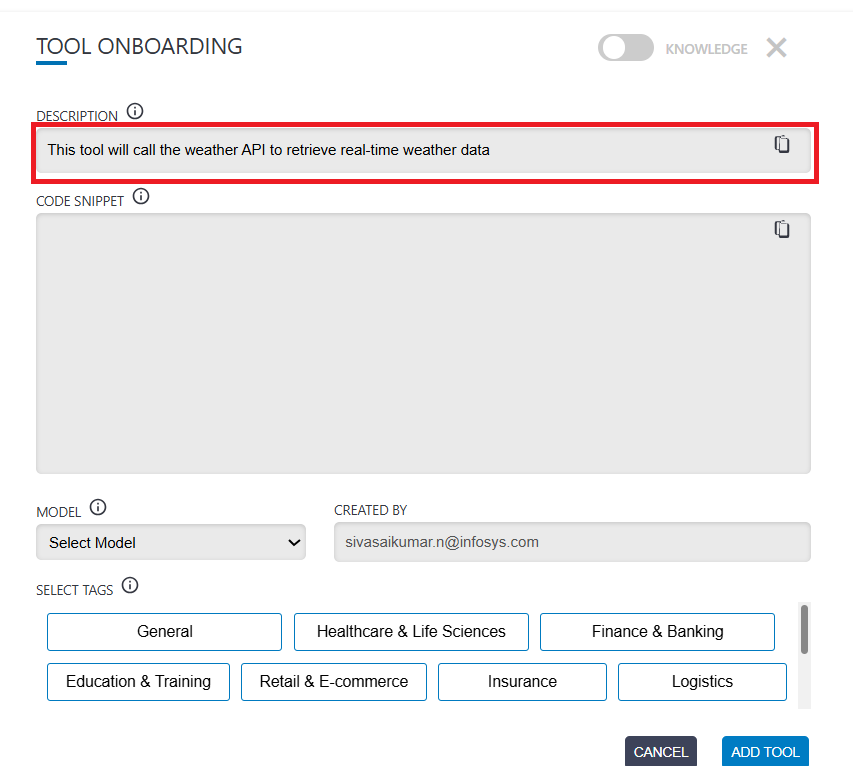
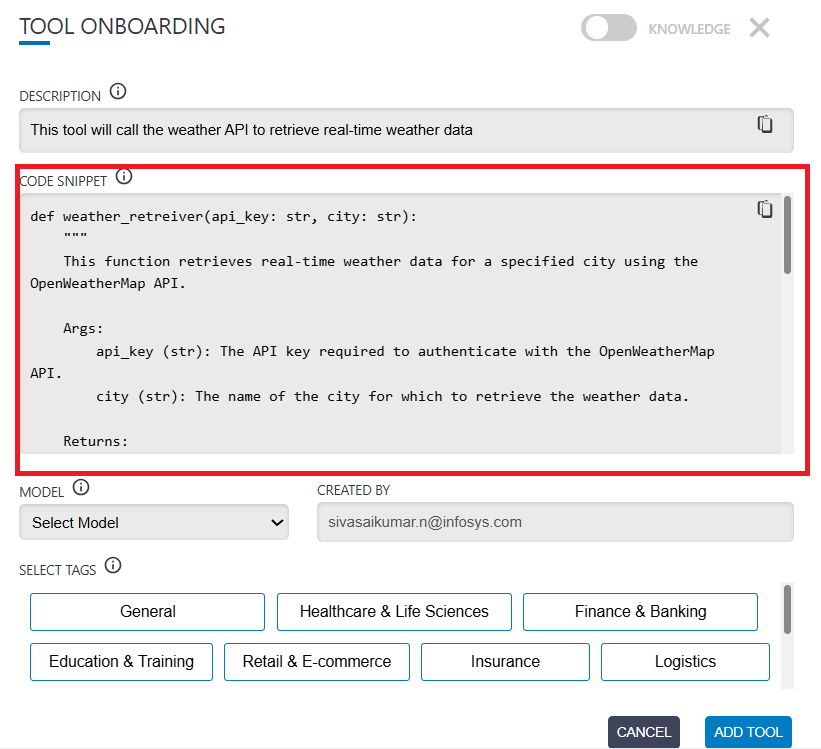
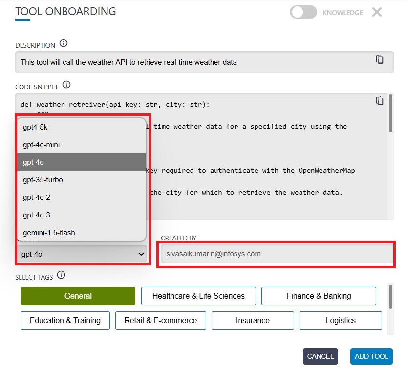
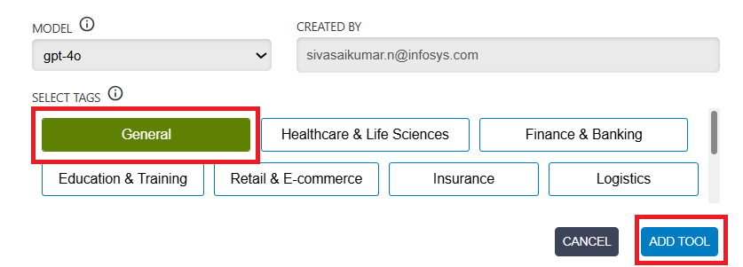
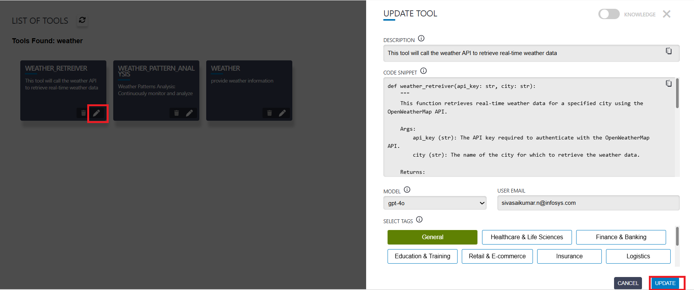
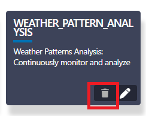
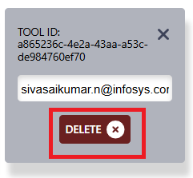

# Tools Configuration

## What Are Tools?

Tools are external functions or actions that an AI agent can call to perform tasks. it can't do with language alone—like searching the web, doing math, or querying a database.

Tools give the agent real-world abilities—they act like plugins or helpers that the agent can call when it needs to go beyond generating text.

Scenario: The AI agent is asked:
"What’s 1234 multiplied by 9876?"

* `Without a tool:` The agent might try to calculate it just by generating the answer with text prediction. It could get it wrong, especially with large numbers, since LLMs aren’t perfect at arithmetic.

* `With a tool:` We give the agent access to a calculator tool (a Python function).

```python
def multiply_numbers(x: int, y: int) -> int:
    return x * y
```

Now, when asked "What’s 1234 multiplied by 9876?"

The agent thinks: This looks like a math problem. I should use the multiply_numbers tool."
So it calls multiply_numbers(1234, 9876) and fetches the correct result .

## Tools Format

To maintain consistency and reliability, each tool should follow a standard format While onboarding .

* `Description:` A short explanation of what the tool does.
* `Code Block:` The tool’s logic, properly indented and syntactically correct.
* `Created By:` Email of the tool creator, used to prevent unauthorized edits.
* `Model:` Once the  model is selected, a doc string for the tool will be generated.
* `Domain Tags:` Optional labels (e.g., manufacturing, logistics) indicating the domain the tool applies to.


## Onboarding Tool

Let's proceed by using the example of onboarding a **Weather Information Retrieval Tool**.

**Step 1:** Provide a short description of the tool. 


**Step 2** Add the python tool code into code snippet.


**Step 3:** Specify the required model and enter your email.


**Step 4:** Select the appropriate domain and click **Add Tool** .



## Updating Tool

If we want to modify a tool that has already been onboarded, we must first ensure that the tool is not currently being referenced by any agent.  

If it is, remove the dependency before starting the update process. Once the tool has been updated, you can re-establish the dependency.

To update a tool, you must also provide the **creator email address**

Select the **Edit** option to start editing, and finally click on **Update**.  



## Deleting a Tool

If you want to delete an existing tool, make sure to first remove any dependencies from agents that are using it.  

Once all dependencies are cleared, you can proceed with deleting the tool.

To delete a tool, you must also provide the **creator email address**

 **Step 1:**  Select the Delete option  


 **Step 2:** Enter the authorized creator’s email ID and click on **Delete**  

